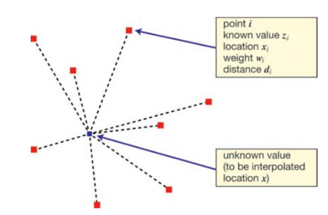
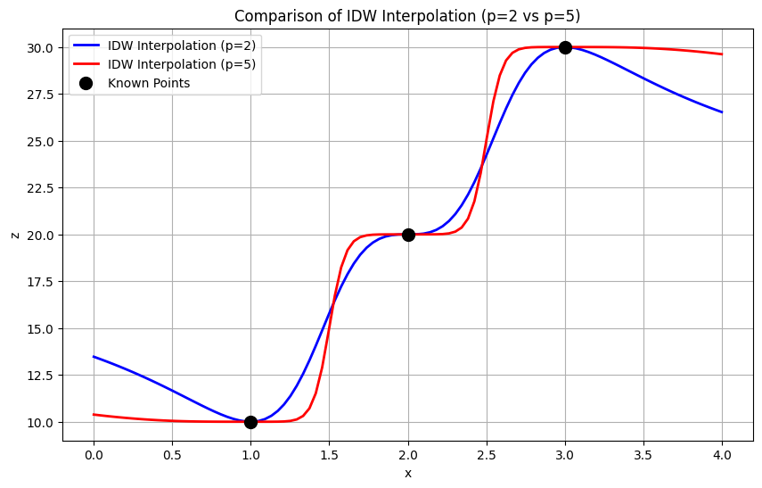
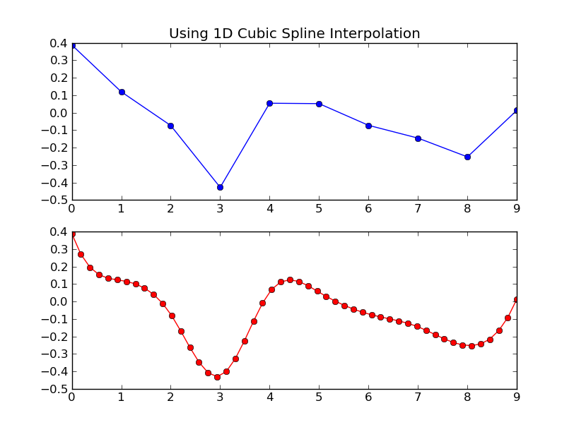
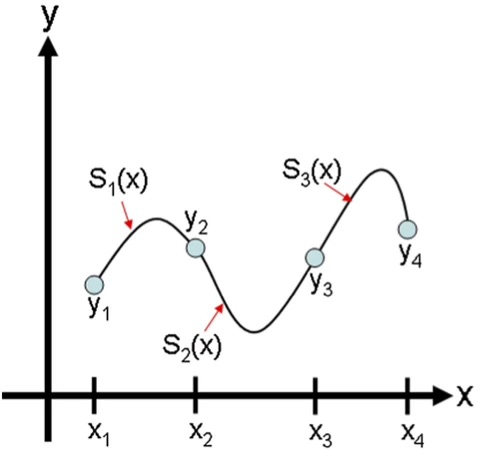
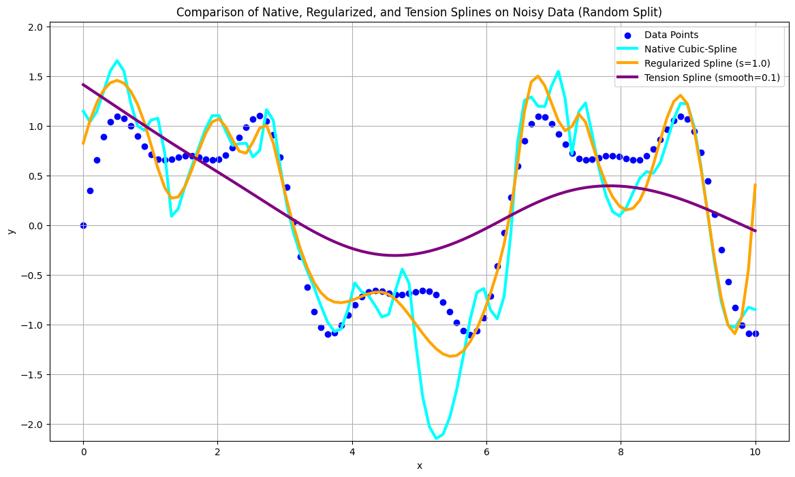
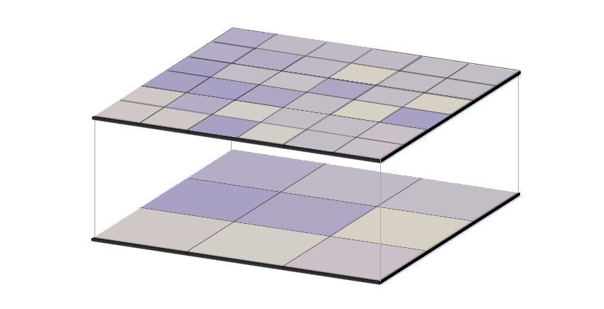
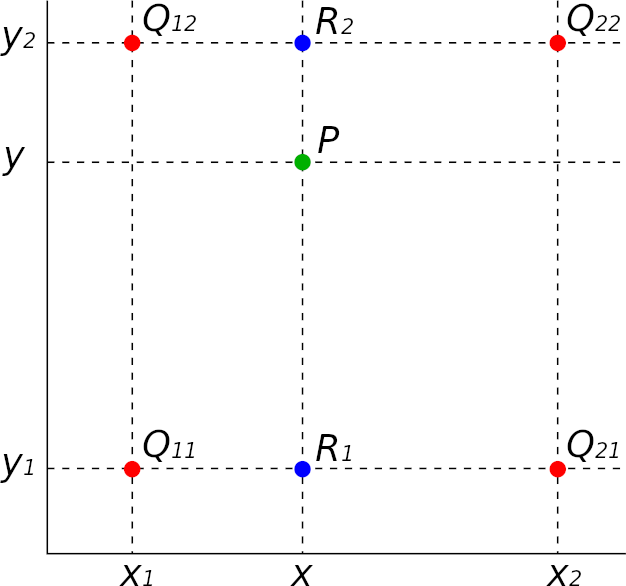

# GEOG 475 Advanced GIS Lab1 - Education Meterial

>**Topic**: Spatial Interpolation
>
>**100 points**
>
>**Author:** Zhenlei Song
>
>**Contact:** [songzl@tamu.edu](mailto:songzl@tamu.edu)

## 1. Evaluation

After one or more rounds of interpolation, we might add or lose some information in the original data. So it's necessary to evaluate the interpolation results by comparing the original data with the interpolated data statistically.

### `Root Mean Square Error (RMSE)`

The `Root Mean Square Error (RMSE)` is an often applied measure to gauge the prediction errors of a regression model.

$$
RMSE = \sqrt{\sum_{i=1}^{n}{\frac{(V_i - \hat{V_i})^2}{n}}} \tag{1}
$$

#### **Why RMSE?**

- **Magnitude Sensitivity**: RMSE is sensitive to the magnitude of errors. It squares the residuals before averaging, which means larger errors have a disproportionately larger impact on the final value.
- **Differentiation Between Models**: RMSE can help differentiate between models by providing a single metric that summarizes the overall error. Lower RMSE values indicate better model performance.
- **Differentiable**: RMSE is differentiable, which means it can be used in optimization algorithms to tune model parameters.

## 2. Spatial Interpolation

>`Spatial Interpolation` is the process of using `control points` with known values to estimate values at other locations with unknown values.

`Control Points` , sample points or observations provide the necessary data needed for interpolation. By `data needed`, we mean the values, locations, and scales of the input dataset.

**A few questions:**

1. Think of a few scenarios where you would use spatial interpolation.
   - You only have a few data points from Brazos County climate stations, but you need to produce a choropleth map for the entire county. **(Lab1.1)**
   - You only have a raster data layer of `Digital Elevation Model (DEM)` at a resolution of 30m, but to save bandwidth, you need to produce raster layers with multiple spatial resolution (90m, and 200m). **(Lab1.2-1)**
   - You only have a raster data layer of `DEM` at 30m resolution, but you need to produce a graph of elevation profile along a transect line. **(Lab1.2-2)**
   - You have a point vector layer (300 * 300 fishnet structured) of `DEM`, whose values were extracted from the original raster layer at 30m resolution, but you need to evaluate how well the point data layer represents the original raster layer. **(Lab1.3)**

2. When applying spatial interpolation, what features of the independent variables need to be determined? Any restristions on the dependent variables?
   - Feature values, locations of the control points, and the locations of the target points.
   - Weights and functions for linear or non-linear transformations.

**So we can formulize the interpolation process as:**
$$
\hat{V_p} = \sum_{i=1}^{n}{\omega_i(x_p) f(V_i, x_i, x_p)} \tag{2}
$$
**Where:**

- $\hat{V_p}$ is the predicted (interpoated) value at the target point.
- $V_i$ is the value at the control point.
- $x_p$ are the coordinates of the target point.
- $x_i$ are the coordinates of the control point.
- $\omega_i$ is the weight of the control point.

### 2.1 Inverse Distance Weighting (IDW)

The IDW technique computes an average value for unsampled locations using values from nearby weighted locations. The weights are proportional to the proximity of the sampled points to the unsampled location and can be specified by the IDW power coefficient. The larger the power coefficient, the stronger the weight of nearby points as can be gleaned from the following equation that estimates the value $\hat{V_p}$ at an unsampled location $x_p$:

$$
\hat{V_p} = \frac{\sum_{i=1}^{n}{\frac{V_i}{d_i^p}}}{\sum_{i=1}^{n}{\frac{1}{d_i^p}}} \tag{3}
$$

**Where:**

- $d_i$ is the distance between the control point and the target point.
- $p$ is the power coefficient.
- $\omega_i(x_p)=1/d_i^p$ is the weight in Eq.1; $f(x)=x$ from Eq.1 means `IDW` is a linear interpolation algorithm.

### **The $p$ parameter**

We can see from Eq.3 that the $p$ parameter is the power coefficient, which controls the weights of the control points. The higher the $p$ value, the more the weights are concentrated on the nearest points. The lower the $p$ value, the more the weights are distributed to all points.

Because $p$ value's manifying effect on the weights, there are some side-effects:

- Smaller $p$ values will lead to smoother spline surfaces, but they may also lead to "over-averaged" that cannot capture local features.
- Larger $p$ can capture local features, while may leading to "over-fitting".

### 2.2 Cubic-Spline

In cubic spline interpolation (as shown in the following figure), the interpolating function is a set of piecewise cubic functions. Specifically, we assume that the points ($x_i$,$y_i$) and ($x_i$+1,$y_i$+1) are joined by a cubic polynomial
$$
   S_i(x)=a_ix^3 x+b_i x^2+ c_i x+ d_i \tag{4}
$$
that is valid for $x_i≤x≤x_{i+1}$, for $i=1,…,n−1$. 

To find the interpolating function, we must first determine the coefficients $a_i,b_i,c_i,d_i$
for each of the cubic functions. For $n$ points, there are $n-1$
cubic functions to find, and each cubic function requires four coefficients. Therefore we have a total of $4(n-1)$
unknowns, and so we need $4(n-1)$ independent equations to find all the coefficients.

It's not intuitive to represent `Cubic-Spline` algo in the way that Eq.1 presents. 
But we can still interpret the `Cubic-Spline` algo, where $f(x)$ is a piecewise cubic function. And to get the weights, let:

1. Interpolation Condition
   $$
   S_i(x_i)=V_i, S_i(x_{i+1})=V_{i+1} \tag{5}
   $$
2. Continuity Condition
   $$
      S_i(x_{i+1})=S_{i+1}(x_{i+1}), \\
      S_i'(x_{i+1})=S_{i+1}'(x_{i+1}), \\
      S_i''(x_{i+1})=S_{i+1}''(x_{i+1}) \tag{6}
   $$
3. Boundry Condition
   $$
   S_1''(x_1)=0, S_n''(x_n)=0 \tag{7}
   $$

Then for the target point $x_p$, we can find the corresponding $S_i(x_p)$, which is the interpolated value at $x_p \in [x_i, x_{i+1}]$:
$$
\hat{V_p} = S_i(x_p) \tag{8}
$$

### 2.3 Overfitting and Regularization

If we dig deeper into the `Cubic-Spline` algo, the mathamatical representation in Eq.5-8 is actually to minimize an error function (loss) with border conditions. The loss function that `Cubic-Spline` algo minimizes is the sum of the squared errors between the interpolated values and the original values, which is basically the same as the `RMSE` in Eq.1.
$$
\min E_{cs} = \sum_{i=1}^{n}{(V_i - S_i(x_i))^2}\\
\text{subject to Eq.5-7} \tag{9}
$$

That means, the native `Cubic-Spline` model provides **lowest `RMSE` value** for all trained points natually. Is this a good news?

Not really.

Consider this scenario:You have 100 data points, but the ground truth contains 1000 points, with 900 unknown. Now you have 2 options:

1. You train the `Cubic-Spline` model with the 100 data points, and the model provides the lowest `RMSE` value for the 100 points. But the model is not able to predict the other 900 points. The training RMSE (100 points) is 0.01, but the testing RMSE (1000 points) is 0.25.
2. You train the `Cubic-Spline` model with the 75 data points, and leave the rest 25 as evaluating set. So that the model is more robust. The training RMSE (75 points) is 0.05, but the testing RMSE (1000 points) is 0.10.

Is this enough? Can we make the model care more about the unknown points during training? That's where the `Regularized` and `Tension` Cubic-Spline comes in.

#### **Regularized Cubic-Spline**

`Cubic-Spline` with `regularization` adds a penalty term to the loss function to prevent overfitting. 

$$
E_{reg} = \sum_{i=1}^{n}{(V_i - S_i(x_i))^2} + \lambda \int{S''(x)^2 dx} \tag{10}
$$

The penalty term is the integral of the **SECOND** derivative of the interpolating function, which is the `curvature` of the function. The `Regularized Cubic-Spline` model blances the `Error` term and the `Curvature` term, so that the model can predict the unknown points more accurately.

#### **Tension Cubic-Spline**

`Cubic-Spline` with `tension` adds a panelty term to the loss function as well, but the penalty term is the integral of the square of the **FIRST** derivative of the interpolating function.

$$
E_{ts} = \sum_{i=1}^{n}{(V_i - S_i(x_i))^2} + \lambda \int{S'(x)^2 dx} \tag{11}
$$

#### **Comparison between `Regularized` and `Tension` `Cubic-Spline`**

| method | goal function | optimization goal | scenario |
|---------------------|--------------------------------------------------------------------------|--------------------------------------------------------------------------|--------------------------------------------------------------------------|
| Regularized | $E_{reg}=\sum_{i=1}^{n}{(V_i - S_i(x_i))^2} + \lambda \int{S''(x)^2 dx}$ | To balance interpolation error and smoothness (curvature) | Reduce noise, anti-overfitting |
| Tension | $E_{reg}=\sum_{i=1}^{n}{(V_i - S_i(x_i))^2} + \lambda \int{S'(x)^2 dx}$ | To balance interpolation error and rigidity (slope) | Reduce oscillations, control curve shape |

## 3. Resampling

To be short, `Resampling` is a type of interpolation. In resampling rasters, the operation that must take place whenever raster data must be transformed to another grid.

### 3.1 `Nearest Neighbor`

`Nearest Neighbor` is the simplest resampling method.
It's a technique for resampling raster data in which the value of each cell in an output raster is calculated using the value of the nearest cell in an input raster. 
Nearest neighbor assignment does not change any of the values of cells from the input layer; for this reason, it is often used to resample categorical or integer data (for example, land use, soil, or forest type), or radiometric values, such as those from remotely sensed images.

### 3.2 `Bilinear Interpolation`

`Bilinear (2-D) interpolation` is defined as linear interpolation on two directions or axes. The 1-D stand for one direction (x axis), while 2-D stands for two directions (x and y axes). The predicted value is actually the `geometrically weighted average` of the four nearest data points

To find value of target point in the new grid $\hat{V_p}$ at $(x,y)$,

1. we need to find the four nearest points $(x_1, y_1), (x_1, y_2), (x_2, y_1), (x_2, y_2)$, and the corresponding values $V_{11}, V_{12}, V_{21}, V_{22}$.

2. Then we can calculate the relative position of the target point in the old grid:

$$
   u=\frac{x-x_1}{x_2-x_1}, v=\frac{y-y_1}{y_2-y_1} \tag{9}
$$

3. Finally, we can calculate the value of the target point in the new grid:

$$
   \hat{V_p} = (1-u)(1-v)V_{11} + u(1-v)V_{21} + (1-u)vV_{12} + uvV_{22} \tag{10}
$$

## References

- [Vector vs Raster in GIS: What’s the Difference?](https://gisgeography.com/spatial-data-types-vector-raster/)
- [Spatial Interpolation](https://mgimond.github.io/Spatial/spatial-interpolation.html)
- [Cubic Spline Interpolation](https://pythonnumericalmethods.studentorg.berkeley.edu/notebooks/chapter17.03-Cubic-Spline-Interpolation.html)
- [Longley, P., Goodchild, M., Maguire, D., & Rhind, D. (2015). Spatial data analysis. In Geographic Information Science and Systems (4th ed., p. 314). Wiley.](https://www.google.com/books/edition/Geographic_Information_Science_and_Syste/C_EwBgAAQBAJ?hl=en&gbpv=1&dq=geographic+information+science+and+systems&printsec=frontcover)