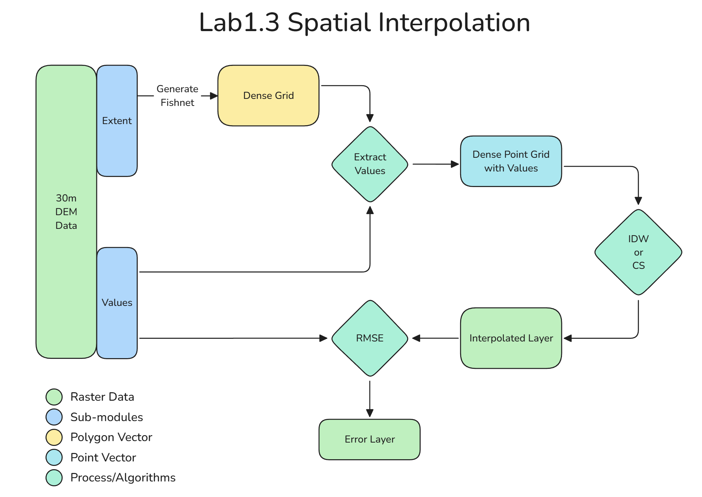

# GEOG 475 Advanced GIS Lab1 - Technical Meterial

>**Topic**: Spatial Interpolation
>
>**100 points**
>
>**Author:** Zhenlei Song
>
>**Contact:** [songzl@tamu.edu](mailto:songzl@tamu.edu)

## Dataset Preview

### **Climate Station Point**

Climate data collected from 18 stations in Brazos County, Texas. The data includes temperature (min, max, avg), and precipitation.

### **Digital Elevation Model (DEM)**

Digital Elevation Model (DEM) data of **Park Range**, northwest of Colorado. The data includes elevation values in meters.

## Lab1-1. Spatial Interpolation

Tasks:

1. Load **Climate Station Point** data.
2. **Split** the data into two parts: `Training` and `Evaluating`.
3. Apply `Cubic-Spline` and `Inverse Distance Weighting (IDW)` interpolation methods on the `Training` set.
   - Interpolate using 2 methods: `Cubic-Spline` and `IDW` on 2 variables: `Temperature` (TAVG) and `Precipitation` (PRCP). So there should be 4 interpolated `raster` layers.
4. **Extract** the values of the interpolated layers at the points of the **Evaluating** set.
5. Calculate the `Root Mean Square Error` (RMSE) of the interpolated values and the **ground-truth** (evaluating set).
6. Tune the parameters of the interpolation methods to **minimize** the RMSE.
   - For `IDW`, tune the `power` parameter $p$.
   - For `Cubic-Spline`, tune it with 2 regulation methods: `tension` and `regulation`.
   - Describe your findings and interpret the results.

**You need to answer the following questions in your report:**

- By comparing the interpolated values using different algorithms, what were the RMSEs using the default parameters? Can you explain the differences according to the characteristics of the algorithms from the **education material**?
- What changes did you make to the parameters of the algorithms? How did the RMSE change?
- Did different algorithms produce a different spatial distribution of `precipitation` and `temperature`? How can you tell the differences **quantitatively**?

## Lab1-2. Raster Resampling

Tasks:

1. Load the **DEM** data and visualize it.
2. `Resample` the DEM data to another **resolutions**: 90m and 200m using 2 different methods: `Nearest Neighbor` and `Bilinear`.
   - 2 resolution * 2 algorithms, there should be 4 output raster layers.
3. Generate coloramp for the resampled DEMs for easier interpretation.
4. Determine a transect line, which should reflect complex elevation changes and cover a reasonable distance.
5. **Interpolate** the elevation values along the transect line using the same algorithms in step 2.
   - The ourput of this step should be 4 interpolated line vectors.
6. **Generate** `profile graphs` for each interpolated line.

**You need to answer the following questions in your report:**

- Examine the topography at grid cell scales of 30m, 90m and 200m. Describe how the topography or spatial patterns changes with the resolution.
- Examine the interpolated results within the same grid cell scale with **different algorithms**. Does the type of interpolation algorithm at a particular scale influence the nature of the topography depicted in the shaded-relief images? If yes, how?
- Compare the interpolated profile values we generated using the 2 algorithms, which one is more accurate to the original DEM (30m)? Can you justify your answer with quantitative evidence?

## Lab1-3. Spatial Interpolation

Tasks:

1. Load the **DEM** raster data and visualize it.
2. Create a 300*300 dense grid (fishnet) from the extents of the **DEM**.
3. Create a dense grid of **POINTS** by extracting values from the **DEM** raster and use the centroids of the dense grid we just created in the previous step.
4. Apply `IDW` and `Cubic-Spline` on the **dense point** layer to interpolate it back to a 30m raster layer (use the shape of the original **DEM** layer).
5. Calculate the `RMSE` between the interpolated raster and the original **DEM**.

**You need to answer the following questions in your report:**

- Compare and contrast the results from the `IDW` and `Cubic-Spline` algorithms to the original data. To what drgrees did the use of different parameter settings influence the results? Did different parameter settings generate different spatial patterns in topography? Was there a difference in terms of the global RMSE?
  - **Hint**: Try different `power` values for the `IDW` algorithm and `spline type` for the `Cubic-Spline`. And compare the results within the same algorithm from aspects of `magnitude` and `spatial distribution`.
- Compare results between 2 algorithms, which one performs better and how do you determine that?
- If we change the sample points density (currently 300*300) to a higher or lower value, which parameter setting do you think will produce the best results? And why?
- Based on your findings and interpretation in Lab1.3, if you restart Lab1.1, how would you choose the algorithms and parameters to produce the best interpolation results?
  - Don't do the actual work, just describe your plan and justify the reasons.

## Grading Policy

- 50%: **Follow the instructions and show intermediate results by screenshots**
  
- 40%: **Answer questions for each subsections and justify your answers with quantitative evidence and figures if needed**
  
- 10%: **Show justification for your parameter tuning from the aspect of formulas and characteristics of the algorithms**
  - For example, explain the differences in RMSE using `regularized` and `tension` in `Cubic-Spline` by the characteristices of the formula mentioned in the textbook or the education material.