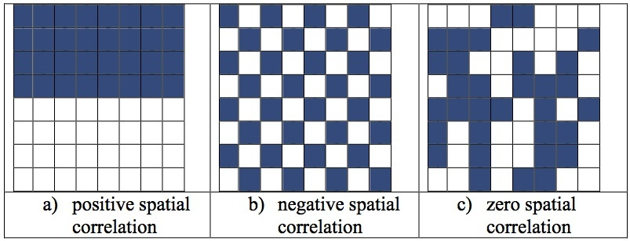
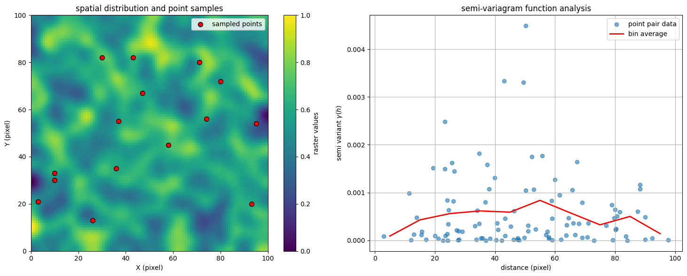
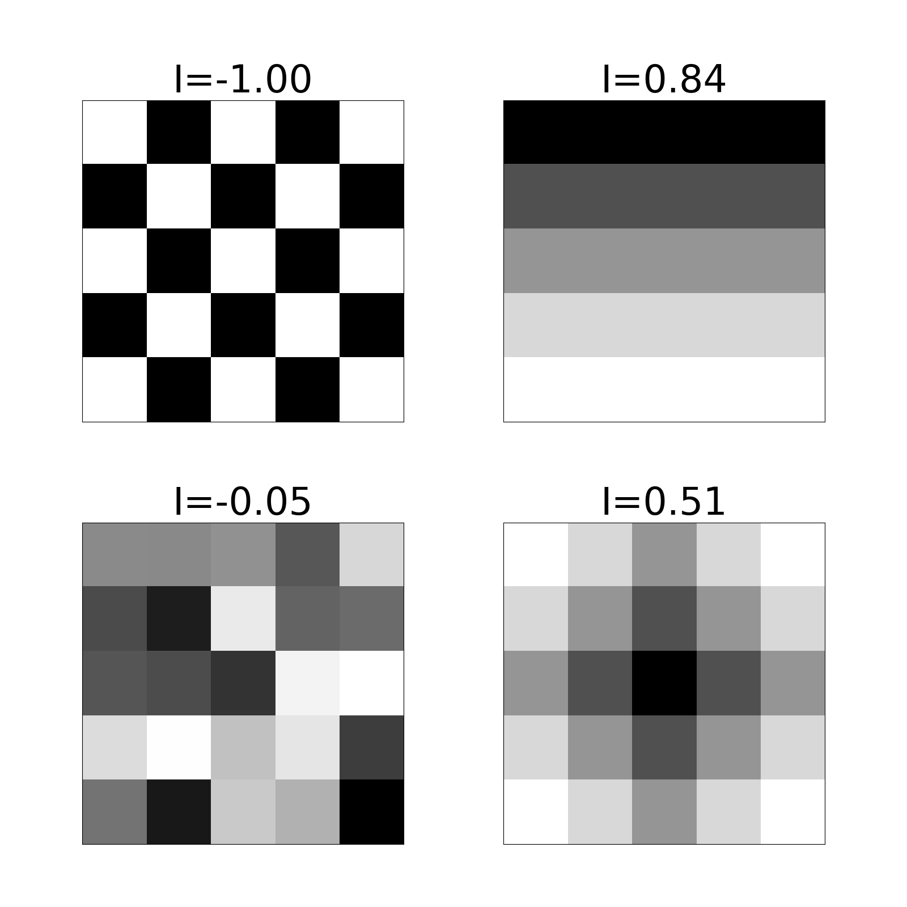

# GEOG 475 Advanced GIS Lab2 - Education Meterial

>**Topic**: Spatial Metrics and Statistics
>
>**100 points**
>
>**Author:** Zhenlei Song
>
>**Contact:** [songzl@tamu.edu](mailto:songzl@tamu.edu)

## 1. Mean & Variance

Suppose we have a list of 2-D data points, no matter the format, we can represent their values in a form of:

$$
    V = \{v_1, v_2, v_3, \cdots, v_n\}\\
    v_i = v(x_i, y_i) \tag{1}\\
    \text{where } i = 1, 2, 3, \cdots, n
$$

### 1.1 Mean

The mean value of the data points can be calculated as:

$$
    \bar{v} = \frac{1}{n} \sum_{i=1}^{n} v_i \tag{2-1}\\
    = \textit{E}(v)
$$

If the phisical meaning of $v_i$ is the 2-D distance to the centroid of the data points, then the mean can be calculated as:

$$
    \bar{v} = \frac{1}{n} \sum_{i=1}^{n} \sqrt{(x_i - \bar{x})^2 + (y_i - \bar{y})^2} \tag{2-2}
$$

### 1.2 Variance

The variance of the data points can be calculated as:

$$
    \sigma^2 = \frac{1}{n} \sum_{i=1}^{n} (v_i - \bar{v})^2 \tag{3-1}
$$

If the phisical meaning of $v_i$ is the 2-D distance to the centroid of the data points, then the variance can be calculated as:

$$
    \sigma^2 = \frac{1}{n} \sum_{i=1}^{n} \left(\sqrt{(x_i - \bar{x})^2 + (y_i - \bar{y})^2} - \bar{v}\right)^2 \\
    = \frac{1}{n} \sum_{i=1}^{n} \left(\sqrt{(x_i - \bar{x})^2 + (y_i - \bar{y})^2} - \frac{1}{n} \sum_{i=1}^{n} \sqrt{(x_i - \bar{x})^2 + (y_i - \bar{y})^2}\right)^2 \tag{3-2} \\
    = \frac{1}{n}\sum_{i=1}^{n}v_i^2 - \frac{1}{n^2}(\sum_{i=1}^{n}v_i)^2\\
    = \textit{E}(v^2) - (\textit{E}(v))^2
$$

Variance or its square root, standard deviation, is a measure of the **`dispersion`** of the data points. It can be used in the context of spatial data to measure the **`heterogeneity`** of the data points. The usage in GIS includes:

- **Landscape Ecology**: The variance of the elevation values in a region can be used to measure the **`roughness`** of the terrain.
- **Remote Sensing**: The variance of the pixel values in an remote-sensing image can be used to classify the **`texture`** of the image.

## 2. Point (Kernel) Density

Similar to **`spatial interpolation`**, **`point density`** is a method to estimate unknown points' values from known points. But there are some differences.

When we applied **`spatial interpolation`** in Lab1, whichever algorithm we used, we were assuming that there is a fixed distribution of all known and unknown points. The purpose is to fit this assumed distribution to both known and unknown points.

In contrast, **`point density`** doesn't have this assumed distribution. But it assumes that the known points affects its surrounding areas. The aim is to model the overall spatial pattern after spatial **superposition** of the effects of multiple points. The **`kernel`** is the function that describes the effect of a single point on its surrounding area.

### 2.1 General Weighted Kernel Density Estimation (KDE) Formula

For $n$ points ${(x_i, y_i, v_i)}_{i=1}^n$, the weighted KDE at location $(x,y)$ is

$$
\hat{f}(x,y) = \frac{1}{h^2\, \sum_{i=1}^{n} v_i} \sum_{i=1}^{n} v_i\, K\!\left(\frac{x-x_i}{h},\,\frac{y-y_i}{h}\right) \tag{4}
$$

where

- $h$ is the bandwidth,
- $K(u,v)$ is a kernel function satisfying $\int_{\mathbb{R}^2} K(u,v)\,du\,dv = 1$.

---

### 2.2 Examples of Specific Kernels

#### Circular Kernel

Define

$$
K_{c}(u,v)=
\begin{cases}
\frac{1}{\pi}, & \text{if } u^2+v^2\le 1,\\[1mm]
0, & \text{otherwise.}
\end{cases}\tag{5-1}
$$

Then the weighted density estimate is

$$
\hat{f}_c(x,y) = \frac{1}{h^2\, \sum_{i=1}^{n} v_i} \sum_{i=1}^{n} v_i\, \frac{1}{\pi}\; I\!\left\{\left(\frac{x-x_i}{h}\right)^2+\left(\frac{y-y_i}{h}\right)^2\le 1\right\} \tag{5-2}
$$

---

#### Square Kernel

Define

$$
K_{s}(u,v)=
\begin{cases}
\frac{1}{4}, & \text{if } |u|\le 1 \text{ and } |v|\le 1,\\[1mm]
0, & \text{otherwise.}
\end{cases} \tag{6-1}
$$

Then the weighted density estimate is

$$
\hat{f}_s(x,y) = \frac{1}{h^2\, \sum_{i=1}^{n} v_i} \sum_{i=1}^{n} v_i\, \frac{1}{4}\; I\!\left\{\left|\frac{x-x_i}{h}\right|\le 1 \text{ and } \left|\frac{y-y_i}{h}\right|\le 1\right\} \tag{6-2}
$$

---

#### Planar Kernel (2D Epanechnikov Kernel)

The planar kernel, often used in two-dimensional kernel density estimation, is defined as

$$
K_{\text{planar}}(u,v)=
\begin{cases}
\displaystyle \frac{2}{\pi}(1 - u^2 - v^2), & \text{if } u^2+v^2\le 1,\\[1mm]
0, & \text{otherwise.}
\end{cases} \tag{7-1}
$$

This kernel assigns weights that decrease quadratically with the distance from the center.

The weighted kernel density estimate at location $(x,y)$ is given by

$$
\hat{f}(x,y) = \frac{1}{h^2\, \sum_{i=1}^{n} v_i} \sum_{i=1}^{n} v_i\, K_{\text{planar}}\!\left(\frac{x-x_i}{h},\,\frac{y-y_i}{h}\right), \tag{7-2}
$$

where  

- $h$ is the bandwidth (smoothing parameter),
- $K_{\text{planar}}(u,v)$ is as defined above.

#### Gaussian Kernel

Define

$$
K_{G}(u,v) = \frac{1}{2\pi}\exp\!\left(-\frac{u^2+v^2}{2}\right) \tag{8-1}
$$

Then the weighted KDE is

$$
\hat{f}_G(x,y) = \frac{1}{h^2\, \sum_{i=1}^{n} v_i} \sum_{i=1}^{n} v_i\, \frac{1}{2\pi}\exp\!\left[-\frac{1}{2}\left(\left(\frac{x-x_i}{h}\right)^2+\left(\frac{y-y_i}{h}\right)^2\right)\right] \tag{8-2}
$$

You can tell differences between those kernels with clear boundry of the areas they affect and those don't. Unlike **`Circular`** and **`Square`** kernels, **`Planar`** and **`Gaussian`** kernels have a **`decay`** effects on the areas they affect. So that the results of **`Planar`** and **`Gaussian`** kernels are **`smoother`**.

The **`bandwidth`** is another important parameter. It controls the **`smoothness`** of the KDE. A small bandwidth will lead to a **`noisy`** KDE, while a large bandwidth will lead to a **`smooth`** KDE.

---

## 3. Spatial Statistical Metrics

### 3.1 Global & Local Variance

Recall the **`Variance`** we mentioned earlier. To be short, it measures how **`dispersed`** for all points $v(x_i, y_i)$. If we consider the raster image as the figure below, the global **`variance`** is a number that represents how diversed of all pixel values. We can imagine there is a window whose shape is the same as the raster image itself, and we are calculating the **`variance`** of all pixel values within this window.

But if we decrease the size of that window, and within each window, there can be a value represents the variance within that window. And all these output variance values will compose another matrix. This matrix is called **`Local Variance`**.

The value range of **`variance`** is $[0, +\infty)$. The larger the value, the more **`dispersed`** the data points are. Is this method revealing enough insights of spatial correlation?

But this method can conly represent the statistical information of the data points. It cannot represent the fact that closer points should have stronger influence on each other. Often, this characteristic is called **`spatial autocorrelation`**.

## 4. Spatial Autocorrelation

> "Everything is related to everything else, but near things are more related than distant things." - Waldo Tobler

### Semi-variogram

An angle of understanding the term `spatial autocorrelation` is to consider the correlation between two points, and answer this question:

**How do this point pair' values change when they are getting further?**

The figure below shows an example raster image, on the left side, with sampled points from it. If we consider all the sampled point as: $p_i=(x_i,y_i,v_i)$. Then we pick 2 random points as a pair, the distance between $p_i$ and $p_j$ is $h_{ij}$ (x-axis of the right sub-figure). And the value difference within this point pair is: $v_{ij}=|v_i-v_j|$ (y-axis of the right sub-figure).

Note: the example above here is a random 2-D raster, it doesn't have any physical meaning, and its values are randomly generated. So there is no autocorrelation at all. It's just used to explain the concept of `semi-variogram`.

The semi-variogram is defined as:

$$
    \gamma(h) = \frac{1}{2N(h)} \sum_{i=1}^{N(h)} (v_i - v_{i+h})^2 \tag{9}
$$

Where,

- $h$: lag distance, the distance between two points.
- $N(h)$: the number of point pairs that have the distance $h$.
- $v_i$, $v_{i+h}$: the value of the point pair $p_i$ and $p_{i+h}$.
- $\gamma(h)$: the semi-variogram value at distance $h$.

But be aware to separate the concept of `spatial autocorrelation` and `spatial varioation`. Some characteristics of both `variation` and `autocorrelation` can be revealed from the `semi-variogram`.

From the figure above, there are 3 important features of the semi-variogram:

- **`Nugget`**: The value of the semi-variogram at the origin. It represents the variance of the data points at the smallest distance. But high `Nugget` doesn't mean spatial continous autocorrelations.
- **`Range`**: The distance (lag) at which the semi-variance reaches a plateau. When the distance is beyond this threshold, spatial autocorrelation is no longer significant.
- **`Sill`**: The value of the semi-variogram becomes stable. the value when the semi-variance function stabilizes and represents the overall level of variability. sill is usually composed of nuggets (microscale variation or error) plus structural variation (variation exhibited with increasing distance).

### Moran's I Index

The term `auto` in autocorrelation means `self`. It represents the relation within the same variable at different locations. The `Moran's I Index` is a measure of spatial autocorrelation. It is defined as:

$$
    I = \frac{N}{W} \cdot \frac{\sum_{i=1}^{m}\sum_{j=1}^{n}\sum_{k=1}^{m}\sum_{l=1}^{n} w_{(i,j),(k,l)} \, (v_{i,j} - \bar{v}) (v_{k,l} - \bar{v})}{\sum_{i=1}^{m}\sum_{j=1}^{n} (v_{i,j} - \bar{v})^2} \tag{9}
$$

where  

- $m$, $n$ are the number of rows and columns of the raster; $N=m \times n$ is the total number of pixels.
- $\bar{v}=\frac{1}{N}\sum_{i=1}^{m} \sum_{j=1}^{n} v_{i,j}$ is the average pixel value.
- $\omega_{(i,j),(k,l)}$ is the spatial weight between pixel $(i,j)$ and $(k,l)$
- $W$ is the sum of all weights: $W = \sum_{i=1}^{m}\sum_{j=1}^{n}\sum_{k=1}^{m}\sum_{l=1}^{n}\omega_{(i,j),(k,l)}$

You now can tell that `Moran's I` can measure the spatial autocorrelation in a good way. The value range of `Moran's I` is $[-1, 1]$. If the value is close to 1, it means the data points are highly correlated. If the value is close to -1, it means the data points are highly negatively correlated. If the value is close to 0, it means the data points are not correlated.

About the spatial weight parameter $\omega$ in Equation.9, it is used to represent the spatial adjacency between two pixels. The common ways to define the spatial weights include:

- **`Queen Contiguity`**

Two spatial units are considered neighbors if they share either a boundary or a vertex.

$$
    w_{(i,j),(k,l)} =
    \begin{cases}
        1, & \text{if unit } (i,j) \text{ and unit } (k,l) \text{ share a boundary or a vertex} \\
        0, & \text{otherwise}
    \end{cases}
$$

- **`Rook Neighbour`**

Two spatial units are considered neighbors only if they share a common boundary (ignoring shared vertices).

$$
    w_{(i,j),(k,l)} =
    \begin{cases}
        1, & \text{if unit } (i,j) \text{ and unit } (k,l) \text{ share a common boundary (Rook contiguity)} \\
        0, & \text{otherwise}
    \end{cases}
$$

## References

- Miller, H. J. (2004). Tobler’s First Law and Spatial Analysis. Annals of the Association of American Geographers, 94(2), 284–289. https://doi.org/10.1111/j.1467-8306.2004.09402005.x
- Li, X. (2025). Spatial Autocorrelation. Github.io. https://xianpingli.github.io/posts_en/2015/12/17/Spatial-autocorrelation/