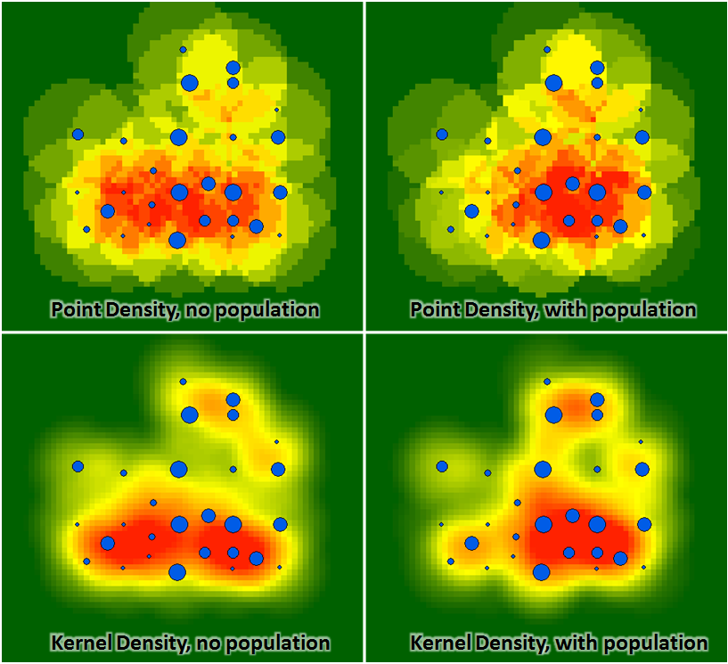
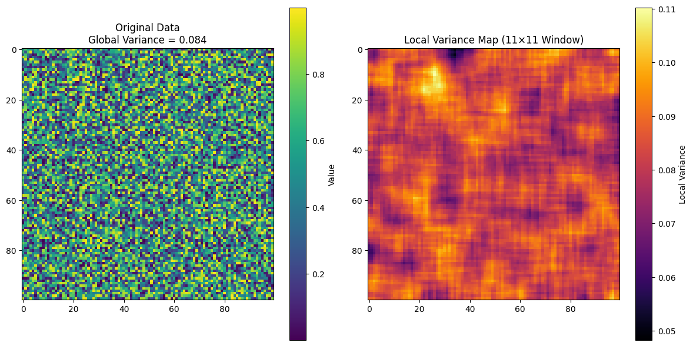

# GEOG 475 Advanced GIS Lab2 - Education Meterial

>**Topic**: Spatial Metrics and Statistics
>
>**100 points**
>
>**Author:** Zhenlei Song
>
>**Contact:** [songzl@tamu.edu](mailto:songzl@tamu.edu)

## 1. Mean & Variance

Suppose we have a list of 2-D data points, no matter the format, we can represent their values in a form of:

$$
    V = \{v_1, v_2, v_3, \cdots, v_n\}\\
    v_i = v(x_i, y_i) \tag{1}\\
    \text{where } i = 1, 2, 3, \cdots, n
$$

### 1.1 Mean

The mean value of the data points can be calculated as:

$$
    \bar{v} = \frac{1}{n} \sum_{i=1}^{n} v_i \tag{2-1}\\
    = \textit{E}(v)
$$

If the phisical meaning of $v_i$ is the 2-D distance to the centroid of the data points, then the mean can be calculated as:

$$
    \bar{v} = \frac{1}{n} \sum_{i=1}^{n} \sqrt{(x_i - \bar{x})^2 + (y_i - \bar{y})^2} \tag{2-2}
$$

### 1.2 Variance

The variance of the data points can be calculated as:

$$
    \sigma^2 = \frac{1}{n} \sum_{i=1}^{n} (v_i - \bar{v})^2 \tag{3-1}
$$

If the phisical meaning of $v_i$ is the 2-D distance to the centroid of the data points, then the variance can be calculated as:

$$
    \sigma^2 = \frac{1}{n} \sum_{i=1}^{n} \left(\sqrt{(x_i - \bar{x})^2 + (y_i - \bar{y})^2} - \bar{v}\right)^2 \\
    = \frac{1}{n} \sum_{i=1}^{n} \left(\sqrt{(x_i - \bar{x})^2 + (y_i - \bar{y})^2} - \frac{1}{n} \sum_{i=1}^{n} \sqrt{(x_i - \bar{x})^2 + (y_i - \bar{y})^2}\right)^2 \tag{3-2} \\
    = \frac{1}{n}\sum_{i=1}^{n}v_i^2 - \frac{1}{n^2}(\sum_{i=1}^{n}v_i)^2\\
    = \textit{E}(v^2) - (\textit{E}(v))^2
$$

Variance or its square root, standard deviation, is a measure of the **`dispersion`** of the data points. It can be used in the context of spatial data to measure the **`heterogeneity`** of the data points. The usage in GIS includes:

- **Geostatistics**: The variance of the residuals of a regression model can be used to measure the **`spatial autocorrelation`** of the residuals.
- **Landscape Ecology**: The variance of the elevation values in a region can be used to measure the **`roughness`** of the terrain.
- **Remote Sensing**: The variance of the pixel values in an remote-sensing image can be used to classify the **`texture`** of the image.

## 2. Point (Kernel) Density

Similar to **`spatial interpolation`**, **`point density`** is a method to estimate unknown points' values from known points. But there are some differences.

When we applied **`spatial interpolation`** in Lab1, whichever algorithm we used, we were assuming that there is a fixed distribution of all known and unknown points. The purpose is to fit this assumed distribution to both known and unknown points.

In contrast, **`point density`** doesn't have this assumed distribution. But it assumes that the known points affects its surrounding areas. The aim is to model the overall spatial pattern after spatial **superposition** of the effects of multiple points. The **`kernel`** is the function that describes the effect of a single point on its surrounding area.

### 2.1 General Weighted Kernel Density Estimation (KDE) Formula

For $n$ points ${(x_i, y_i, v_i)}_{i=1}^n$, the weighted KDE at location $(x,y)$ is

$$
\hat{f}(x,y) = \frac{1}{h^2\, \sum_{i=1}^{n} v_i} \sum_{i=1}^{n} v_i\, K\!\left(\frac{x-x_i}{h},\,\frac{y-y_i}{h}\right) \tag{4}
$$

where

- $h$ is the bandwidth,
- $K(u,v)$ is a kernel function satisfying $\int_{\mathbb{R}^2} K(u,v)\,du\,dv = 1$.

---

### 2.2 Examples of Specific Kernels

#### Circular Kernel

Define

$$
K_{c}(u,v)=
\begin{cases}
\frac{1}{\pi}, & \text{if } u^2+v^2\le 1,\\[1mm]
0, & \text{otherwise.}
\end{cases}\tag{5-1}
$$

Then the weighted density estimate is

$$
\hat{f}_c(x,y) = \frac{1}{h^2\, \sum_{i=1}^{n} v_i} \sum_{i=1}^{n} v_i\, \frac{1}{\pi}\; I\!\left\{\left(\frac{x-x_i}{h}\right)^2+\left(\frac{y-y_i}{h}\right)^2\le 1\right\} \tag{5-2}
$$

---

#### Square Kernel

Define

$$
K_{s}(u,v)=
\begin{cases}
\frac{1}{4}, & \text{if } |u|\le 1 \text{ and } |v|\le 1,\\[1mm]
0, & \text{otherwise.}
\end{cases} \tag{6-1}
$$

Then the weighted density estimate is

$$
\hat{f}_s(x,y) = \frac{1}{h^2\, \sum_{i=1}^{n} v_i} \sum_{i=1}^{n} v_i\, \frac{1}{4}\; I\!\left\{\left|\frac{x-x_i}{h}\right|\le 1 \text{ and } \left|\frac{y-y_i}{h}\right|\le 1\right\} \tag{6-2}
$$

---

#### Planar Kernel (2D Epanechnikov Kernel)

The planar kernel, often used in two-dimensional kernel density estimation, is defined as

$$
K_{\text{planar}}(u,v)=
\begin{cases}
\displaystyle \frac{2}{\pi}(1 - u^2 - v^2), & \text{if } u^2+v^2\le 1,\\[1mm]
0, & \text{otherwise.}
\end{cases} \tag{7-1}
$$

This kernel assigns weights that decrease quadratically with the distance from the center.

The weighted kernel density estimate at location $(x,y)$ is given by

$$
\hat{f}(x,y) = \frac{1}{h^2\, \sum_{i=1}^{n} v_i} \sum_{i=1}^{n} v_i\, K_{\text{planar}}\!\left(\frac{x-x_i}{h},\,\frac{y-y_i}{h}\right), \tag{7-2}
$$

where  

- $h$ is the bandwidth (smoothing parameter),
- $K_{\text{planar}}(u,v)$ is as defined above.

#### Gaussian Kernel

Define

$$
K_{G}(u,v) = \frac{1}{2\pi}\exp\!\left(-\frac{u^2+v^2}{2}\right) \tag{8-1}
$$

Then the weighted KDE is

$$
\hat{f}_G(x,y) = \frac{1}{h^2\, \sum_{i=1}^{n} v_i} \sum_{i=1}^{n} v_i\, \frac{1}{2\pi}\exp\!\left[-\frac{1}{2}\left(\left(\frac{x-x_i}{h}\right)^2+\left(\frac{y-y_i}{h}\right)^2\right)\right] \tag{8-2}
$$

You can tell differences between those kernels with clear boundry of the areas they affect and those don't. Unlike **`Circular`** and **`Square`** kernels, **`Planar`** and **`Gaussian`** kernels have a **`decay`** effects on the areas they affect. So that the results of **`Planar`** and **`Gaussian`** kernels are **`smoother`**.

The **`bandwidth`** is another important parameter. It controls the **`smoothness`** of the KDE. A small bandwidth will lead to a **`noisy`** KDE, while a large bandwidth will lead to a **`smooth`** KDE.

---

## 3. Spatial Statistical Metrics

Recall the **`Variance`** we mentioned earlier. To be short, it measures how **`dispersed`** for all points $v(x_i, y_i)$.

