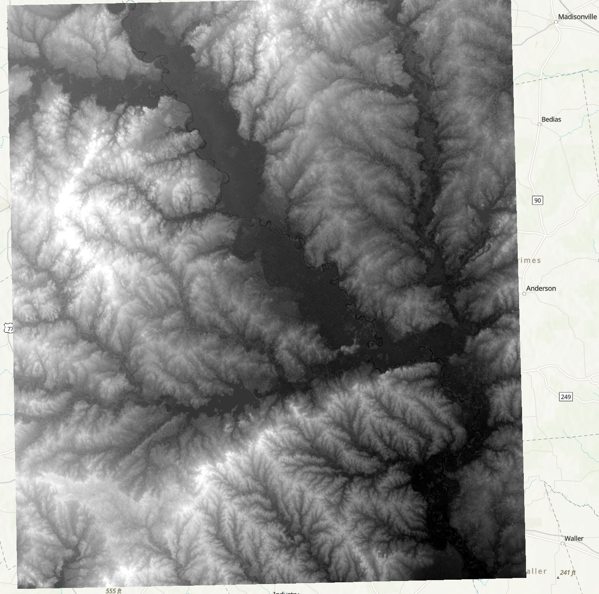
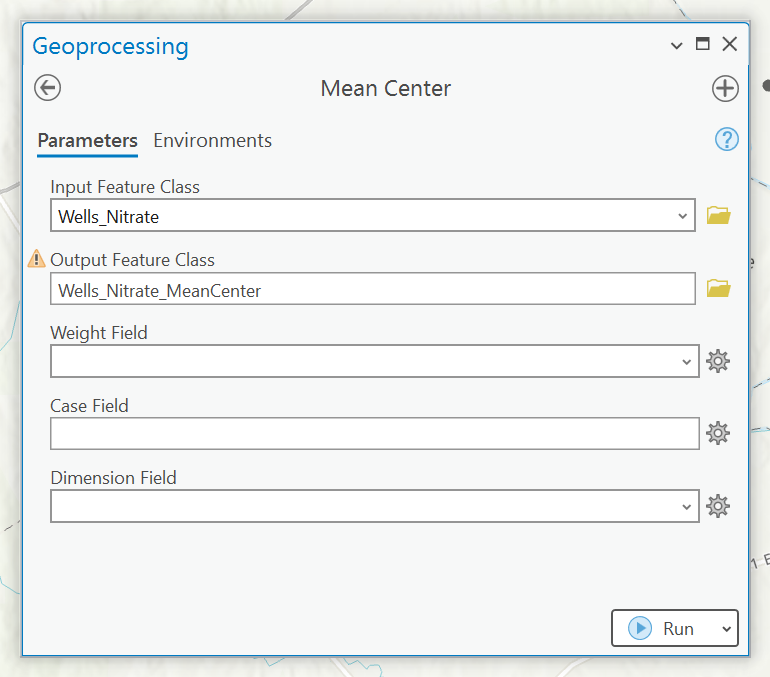
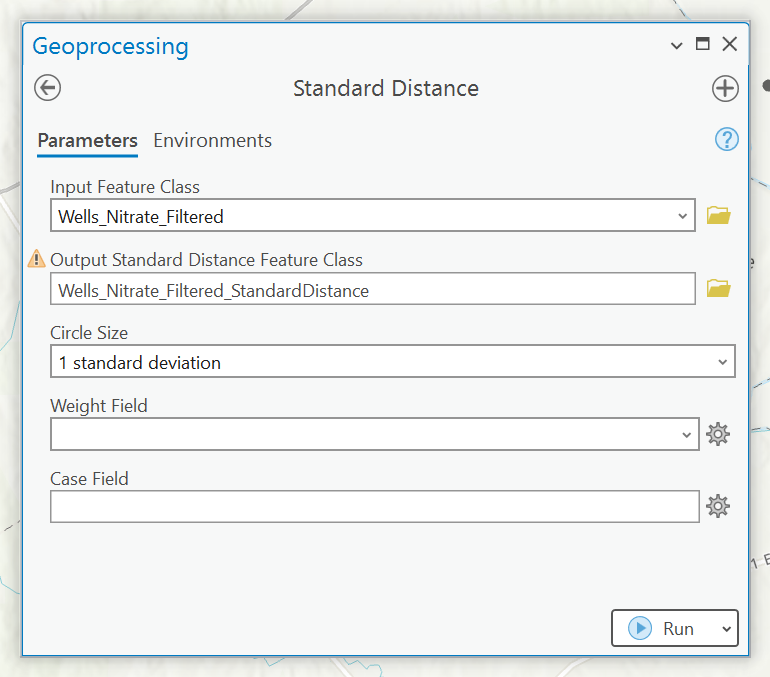
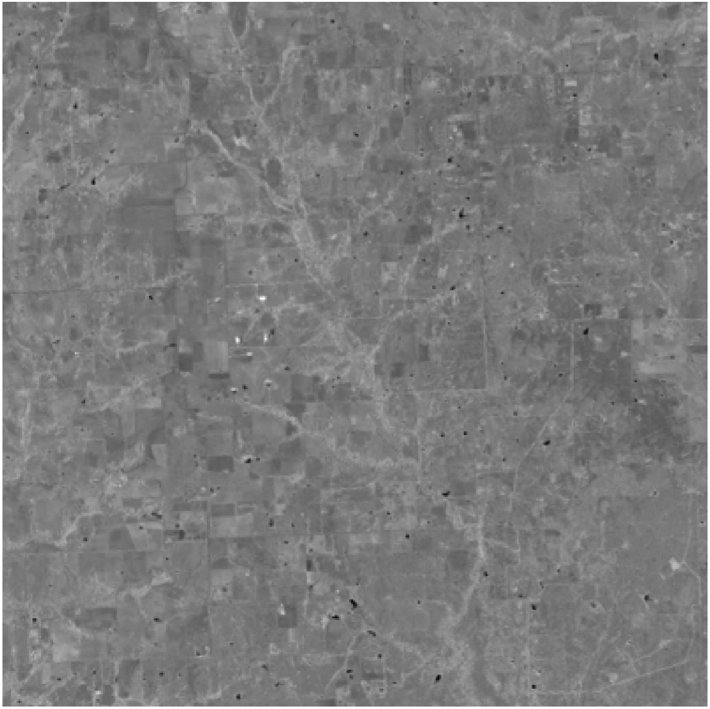
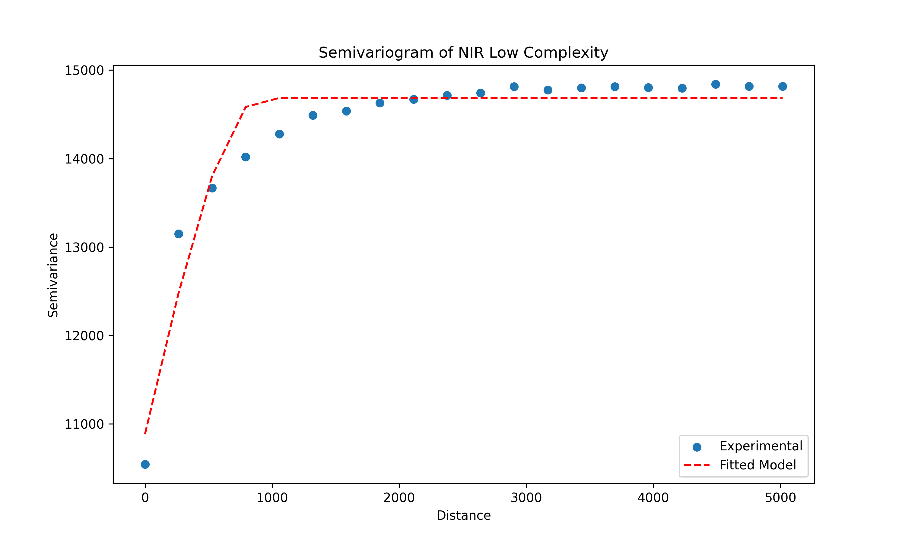
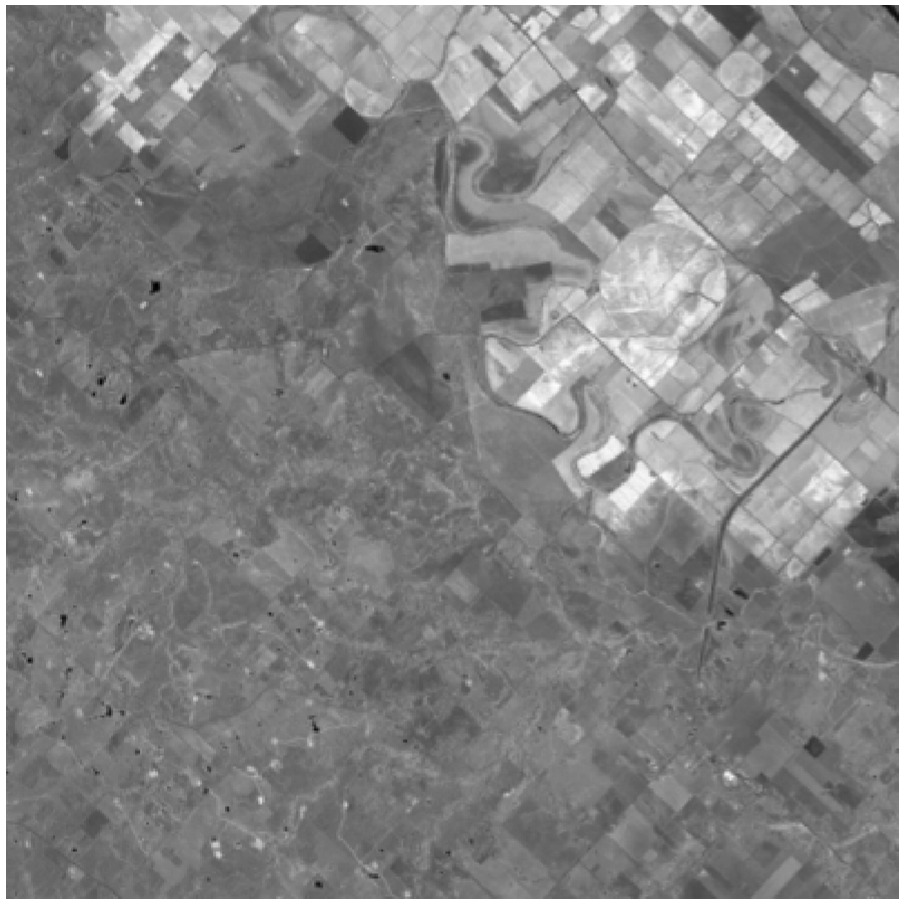
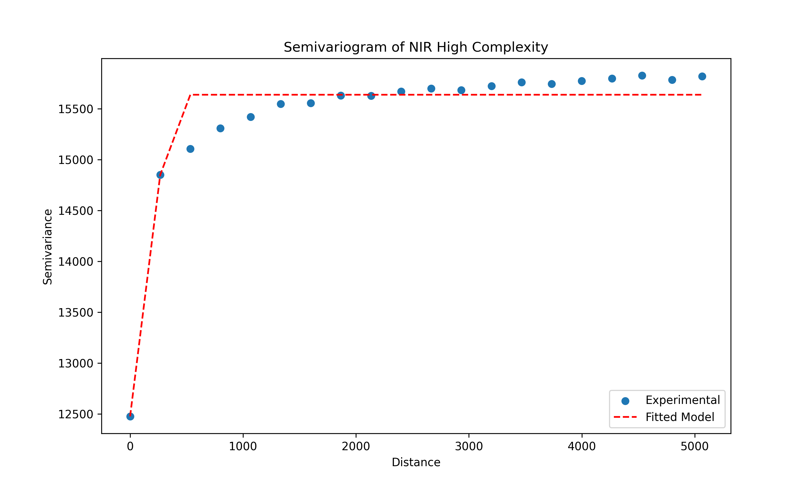
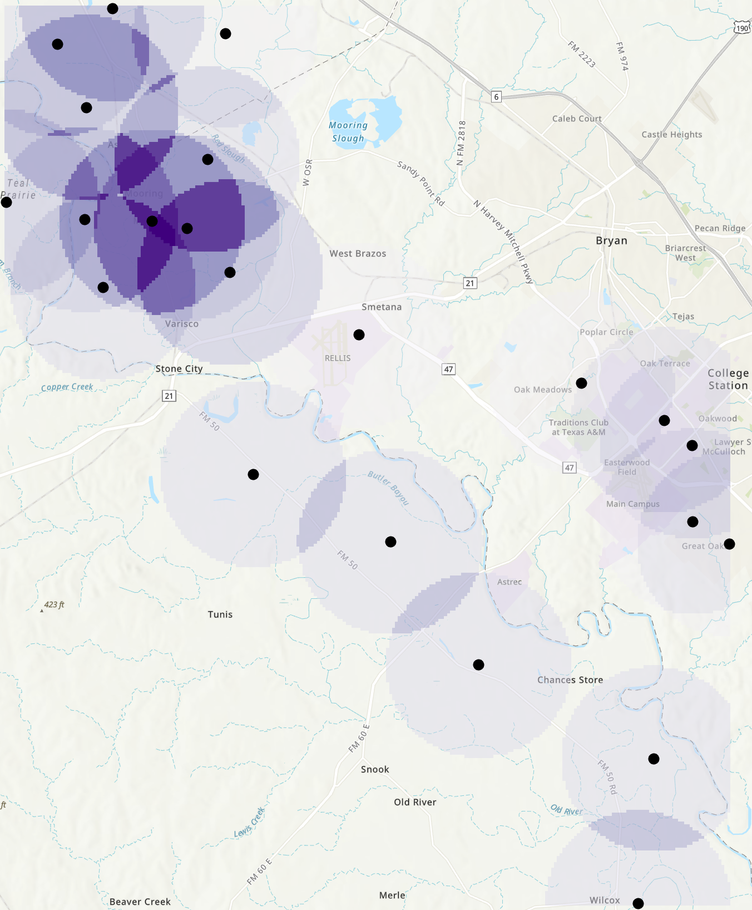
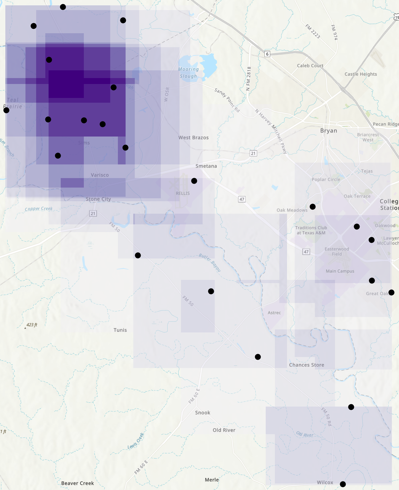
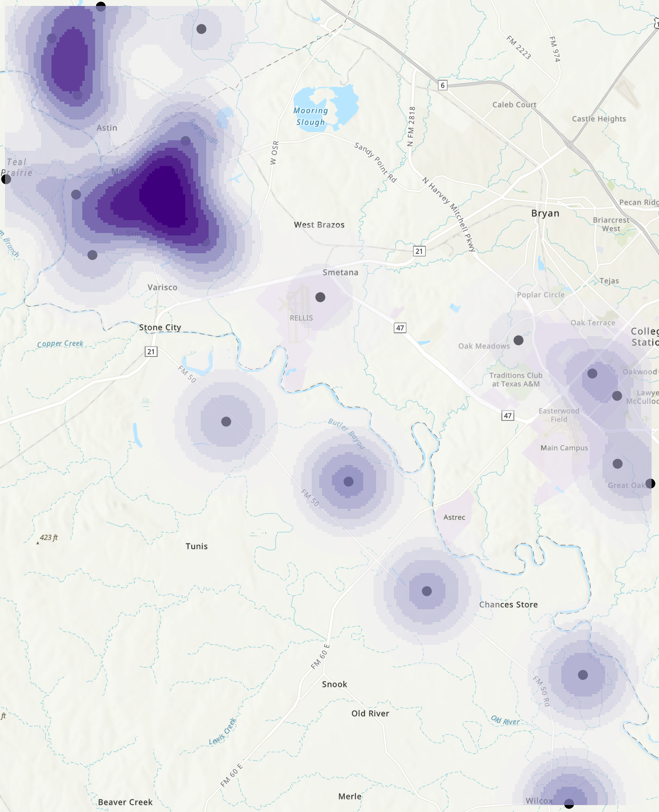

# GEOG 475 Advanced GIS Lab2 - Technical Meterial

>**Topic**: Spatial Metrics and Statistics
>
>**100 points**
>
>**Author:** Zhenlei Song
>
>**Contact:** [songzl@tamu.edu](mailto:songzl@tamu.edu)

## Dataset Preview

### DEM of College Station / Bryan, TX

### Satellite Image: LANDSAT

The images below show USGS Landsat 8 Level 2, Collection 2, Tier 1 satellite images of Brazos County, TX. The bands in this set are:

- Band 1:  (blue) surface reflectance
- Band 2:  (green) surface reflectance
- Band 3:  (red) surface reflectance
- NIR:  (near-infrared) surface reflectance

All bands are atmospherically corrected to reflect surface reflections.

  <figure style="margin: 0; text-align: center;">
    
    <figcaption>Band 1</figcaption>
  </figure>
  <figure style="margin: 0; text-align: center;">
    
    <figcaption>Band 2</figcaption>
  </figure>
  <figure style="margin: 0; text-align: center;">
    
    <figcaption>Band 3</figcaption>
  </figure>
  <figure style="margin: 0; text-align: center;">
    
    <figcaption>NIR Band</figcaption>
  </figure>

### Water Well Nitration Data

The dataset contains the nitrate concentration of water wells in Brazos County, TX. The nitrate concentration is a measure of the water quality.

## Part 1. Spatial Statistical Metrics

Steps:

1. Load the `NIR` band of the **LANDSAT** image, and the `DEM` raster.
2. Calculate the `Standard Deviation` of both raster images using 2 window sizes: 3x3, and 11x11. So the output should be 4 new raster layers.
3. Intepret the magnitude and the spatial pattern of the output rasters, and determine what does they characterize in the images.

Output should look like:

  <figure style="margin: 0; text-align: center;">
    
    <figcaption>Standard Deviation of DEM 3x3</figcaption>
  </figure>
  <figure style="margin: 0; text-align: center;">
    
    <figcaption>Standard Deviation of DEM 11x11</figcaption>
  </figure>
  <figure style="margin: 0; text-align: center;">
    
    <figcaption>Standard Deviation of NIR 3x3</figcaption>
  </figure>
  <figure style="margin: 0; text-align: center;">
    
    <figcaption>Standard Deviation of NIR 11x11</figcaption>
  </figure>

### Questions to answer:

- Show the output map of the raster that represents the standard deviation of the `NIR` spectral data.
  - What information is generated when the metric is used on the `NIR` spectral data?
  - What does it effectively highlight?
  - Does the nature of the information change when you change the window size from 3x3 to 11x11?
  - Speculate on what you think this information could be used for (e.g., a particular application, mapping, assessing the landscape)?

- Show the output map of the raster that represents the standard deviation of the `DEM` data.
  - What information is generated when the metric is used on the `DEM` data?
  - What does it effectively highlight?
  - Does the nature of the information change when you change the window size from 3x3 to 11x11?
  - Theoretically, what topographic property should the metric characterize?
  - Speculate on what you think this information could be used for (e.g., a particular application, mapping, assessing the landscape).

## Part 2. Point Distance and Variability Metrics

Steps:

1. Load the `Well Nitrate` data.
2. Filter out the wells that have nitrate concentration greater than 10 ppm, mark as `Well Nitrate Filtered` later.
3. Calculate the `Mean Center` and the `Standard Distance` of both `Well Nitrate` and the `Well Nitrate Filtered` data.
4. Describe, compare, and intepret the results of the `Mean Center` and the `Standard Distance` of the two datasets.

  <figure style="margin: 0; text-align: center;">
    
    <figcaption>Mean Center</figcaption>
  </figure>
  <figure style="margin: 0; text-align: center;">
    
    <figcaption>Standard Distance</figcaption>
  </figure>

The output should look like:

### Questions to answer:

- Show the map of water-well location pattern.
  - Describe the water-well location pattern across Brazos County using the metrics that you generated.  

- Show the map of water-well location pattern for contaminated wells.
  - Describe the water-well location pattern for contaminated wells across Brazos County.
  - Compare and contrast the distribution pattern of all points and the contaminated points.

- Does the contamination pattern reflect any potential sources of pollution (hint: examine the satellite imagery and examine the land use patterns with their maps)?

## Part 3. Spatial Autocorrelation Metrics

Steps:

1. Load the `LandSAT NIR Band` image data.
2. Select 2 areas which reflect comparatively high and low spatial complexity (sample 1 and sample 2).
     - Make sure 2 areas are of the same size (400 \* 400 pixels, eq to 12000m \* 12000m).
     - This is actually a **`HARD`** step, how do you know if the areas you selected are of high or low complexity?
3. Apply global semi-variogram analysis to the 2 areas.
    - There are many ways to complete this step.
    - Suggesstions: ENVI, QGIS, or write your own code to do this step. ArcGIS is not recommended at this step.
4. Apply Moran's I analysis to the 2 areas.
   - Same as step 3, improvise your own way to do this step
   - ArcGIS is not recommended at this step because it doesn't have a Moran's I tool for raster data.
5. Describe, compare, and intepret the results of the two analyses.

Flowchart:

Results:

  <figure style="margin: 0; text-align: center;">
    
    <figcaption>LandSAT Subset with low Complexity</figcaption>
  </figure>
  <figure style="margin: 0; text-align: center;">
    
    <figcaption>Semi-Variogram from low complexity subset</figcaption>
  </figure>

**The Moran' I index of this area is: 0.81004**

  <figure style="margin: 0; text-align: center;">
    
    <figcaption>LandSAT Subset with high Complexity</figcaption>
  </figure>
  <figure style="margin: 0; text-align: center;">
    
    <figcaption>Semi-Variogram from high-complexity subset </figcaption>
  </figure>

**The Moran' I index of this area is: 0.95085**

Questions to answer:

1. Did your two samples (semivariograms) accurately depict relatively high versus relatively low spatial variation in spectral variation?  
   - How do you know this?  Provide evidence based on your interpretation of the semivariograms with the screenshots of your results.  
   - Was there any significant scale-dependent variation that is related to structural or environmental conditions, or was the variation relatively constant with scale (lag distance)?

2. Could you find geographic areas with greater or less spatial variability (provide the screenshots)?  
   - How did these compare to your initial sample sets (provide the screenshots)?

## Part 4. Point-Pattern Analysis

### Steps:

1. Load the **`filtered`** Well Nitrate data from Part 2.
2. Apply `Point Density` tool on the filtered well nitrate data.
    - Use different neighborhood shapes (`Circle`, `Rectangle`).
3. Apply `Kernel Density` tool on the filtered well nitrate data.
    - Use different output cell sizes and varying search radius.
4. Compare and contrast the results from the point density and the kernel density tools.
    - Give your reasonable hypothesis on the sources of the nitrate contamination in Brazos County.

### Flowchart:

### Results:

  <figure style="margin: 0; text-align: center;">
    
    <figcaption>Point Density with Circle Neightborhood</figcaption>
  </figure>
  <figure style="margin: 0; text-align: center;">
    
    <figcaption>Point Density with Rectangle Neightborhood </figcaption>
  </figure>

  <figure style="margin: 0; text-align: center;">
    
    <figcaption>Point Density with Annulus Neightborhood</figcaption>
  </figure>
  <figure style="margin: 0; text-align: center;">
    
    <figcaption>Kernel Density </figcaption>
  </figure>

### Questions to answer:

1. Compare and contrast the point patterns derived from the point density tool with different neighborhood shapes (show the maps).  
   - How does the shape of the neighborhood influence the spatial distribution of contamination?

2. Compare and contrast the point patterns derived from the kernel density tool with different output cell sizes and varying search radius.
   - How does the output size influence the spatial pattern that is obtained (be sure to keep the radius constant when you compare results) (show the maps)?
   - How does the search radius influence the point-pattern distribution (show the maps)?  
   - How would you determine which cell size and distance to use to accurately depict potential hotspots of groundwater contamination?

3. Compare and contrast the results from the point density and the kernel density tools with the screenshots of maps.  
   - Do they present similar or different point-pattern results?

4. Finally, interpret your point-pattern analysis results.
   - What do the results suggest about the sources of groundwater contamination in Brazos County?
   - Can these patterns be attributed to natural processes or anthropogenic factors?
     - Hint: Be specific in terms of what you hypothesize is the cause of the groundwater contamination.  Be sure to utilize additional spatial data to help verify your interpretation (e.g., satellite imagery or DEM).

## Due Date:

- Section 501 (Monday Section): Mar 3 at 11:59pm
- Section 504 (Thursday Section): Mar 6 at 11:59pm

## Submission:

### What to submit:

A `.doc/docx` file that includes:

- Contextx and necessary screenshots (with captions) to prove you finished all the required steps.
  - refer to the `results` subsections in each part.
- Well-supported answers to all questions in each part.
  - You need to justify your answers with quantitative evidence and figures if needed.

### Where to submit:

Through this [canvas link](https://canvas.tamu.edu/courses/358912/assignments/2411084).

## Grading Policy:

- 50%: **Follow the instructions and show intermediate results by screenshots**
  
- 40%: **Answer questions for each subsections and justify your answers with quantitative evidence and figures if needed**
  
- 10%: **Show justification for your parameter tuning from the aspect of formulas and characteristics of the algorithms**
