# GEOG 475 Advanced GIS Lab2 - Technical Meterial

>**Topic**: Spatial Metrics and Statistics
>
>**100 points**
>
>**Author:** Zhenlei Song
>
>**Contact:** [songzl@tamu.edu](mailto:songzl@tamu.edu)

## Dataset Preview

### Satellite Image: LANDSAT

The images below show USGS Landsat 8 Level 2, Collection 2, Tier 1 satellite images of Brazos County, TX. The bands in this set are:

- Band 1:  (blue) surface reflectance
- Band 2:  (green) surface reflectance
- Band 3:  (red) surface reflectance
- NIR:  (near-infrared) surface reflectance

All bands are atmospherically corrected to reflect surface reflections.

  <figure style="margin: 0; text-align: center;">
    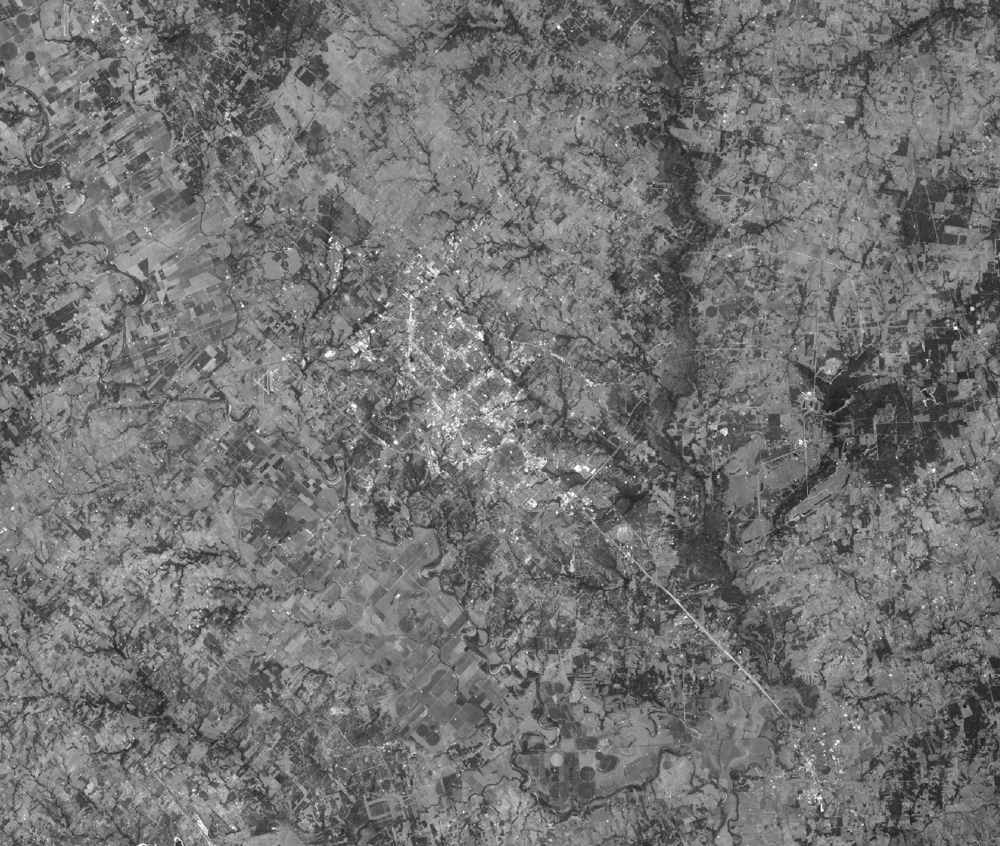
    <figcaption>Band 1</figcaption>
  </figure>
  <figure style="margin: 0; text-align: center;">
    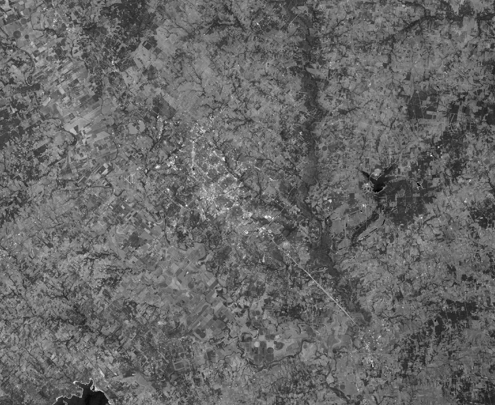
    <figcaption>Band 2</figcaption>
  </figure>
  <figure style="margin: 0; text-align: center;">
    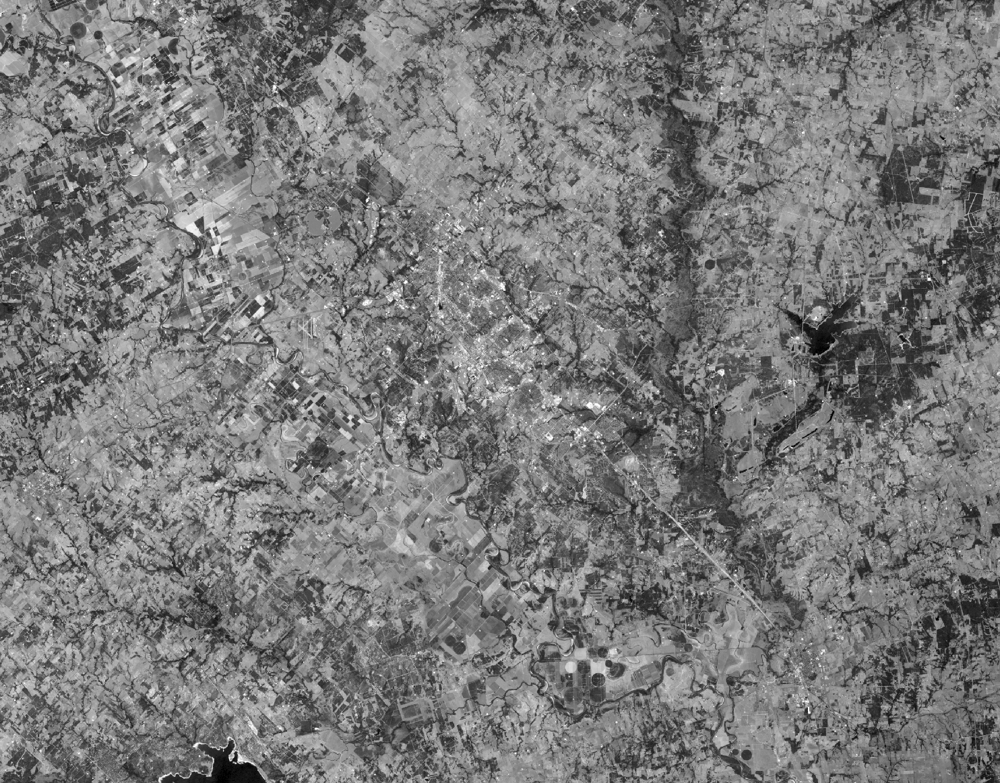
    <figcaption>Band 3</figcaption>
  </figure>
  <figure style="margin: 0; text-align: center;">
    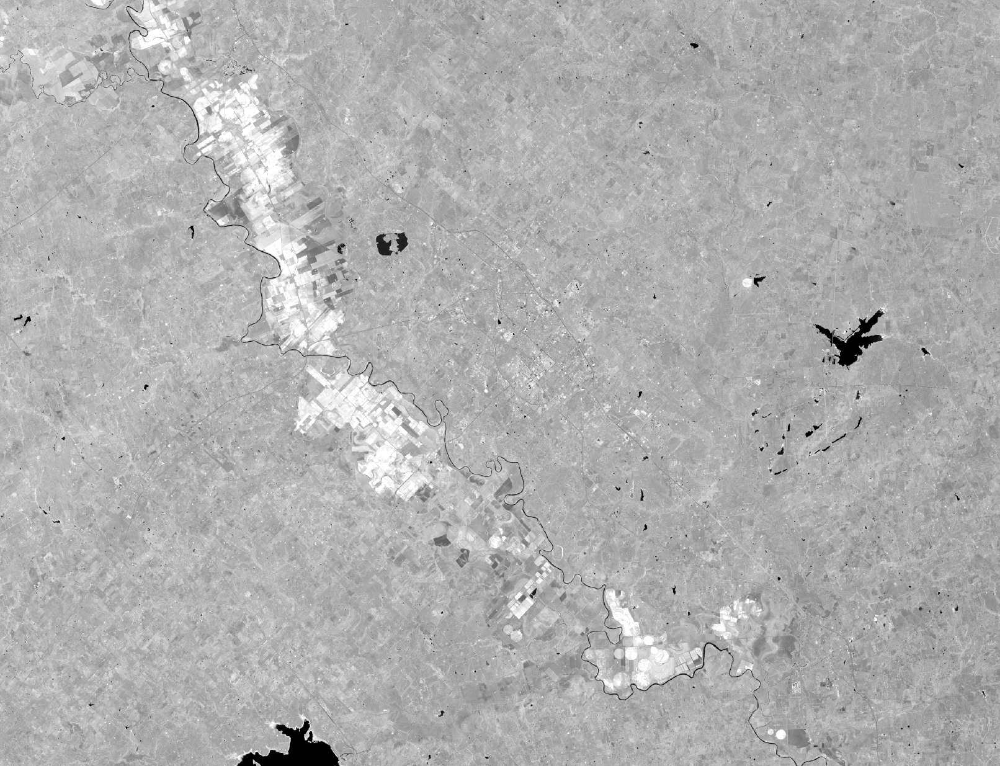
    <figcaption>NIR Band</figcaption>
  </figure>

### Water Well Nitration Data

The dataset contains the nitrate concentration of water wells in Brazos County, TX. The nitrate concentration is a measure of the water quality.
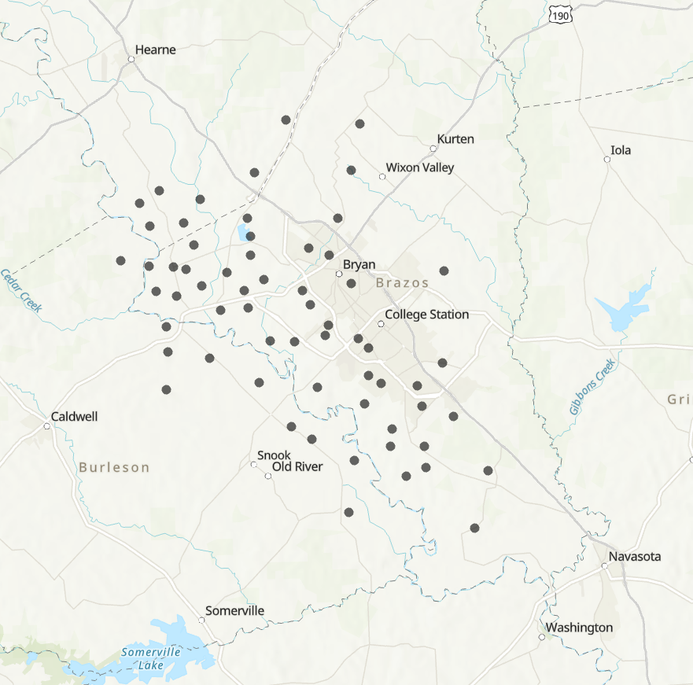

## Part 1. Spatial Statistical Metrics

Steps:

1. Load the `NIR` band of the **LANDSAT** image, and the `DEM` raster.
2. Calculate the `Standard Deviation` of both raster images using 2 window sizes: 3x3, and 11x11. So the output should be 4 new raster layers.
3. Intepret the magnitude and the spatial pattern of the output rasters, and determine what does they characterize in the images.

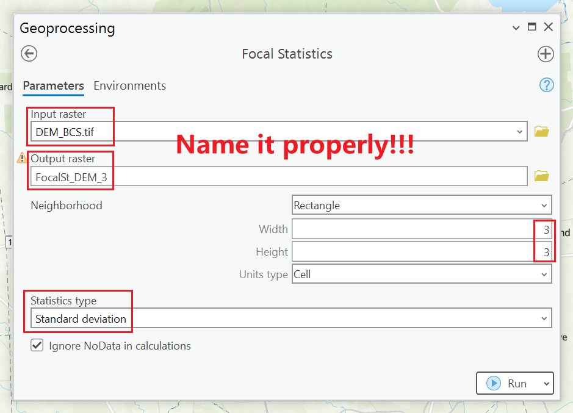

Output should look like:

  <figure style="margin: 0; text-align: center;">
    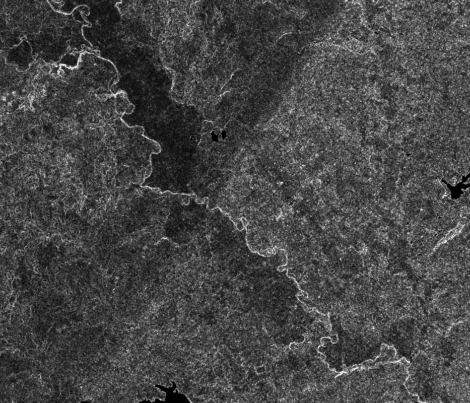
    <figcaption>Standard Deviation of DEM 3x3</figcaption>
  </figure>
  <figure style="margin: 0; text-align: center;">
    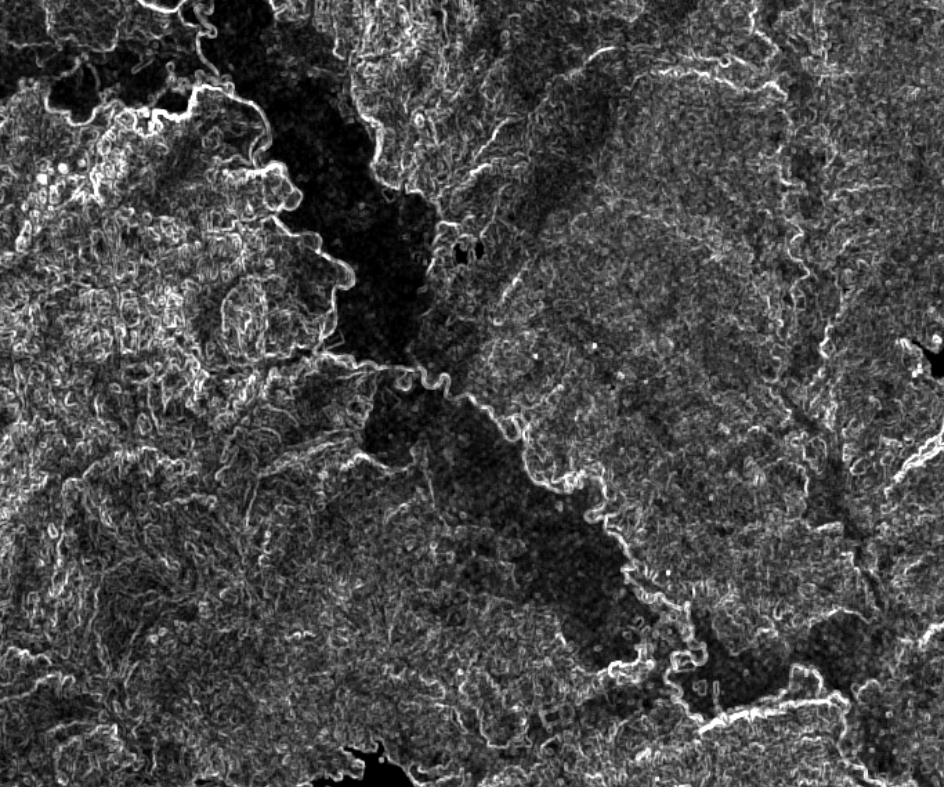
    <figcaption>Standard Deviation of DEM 11x11</figcaption>
  </figure>
  <figure style="margin: 0; text-align: center;">
    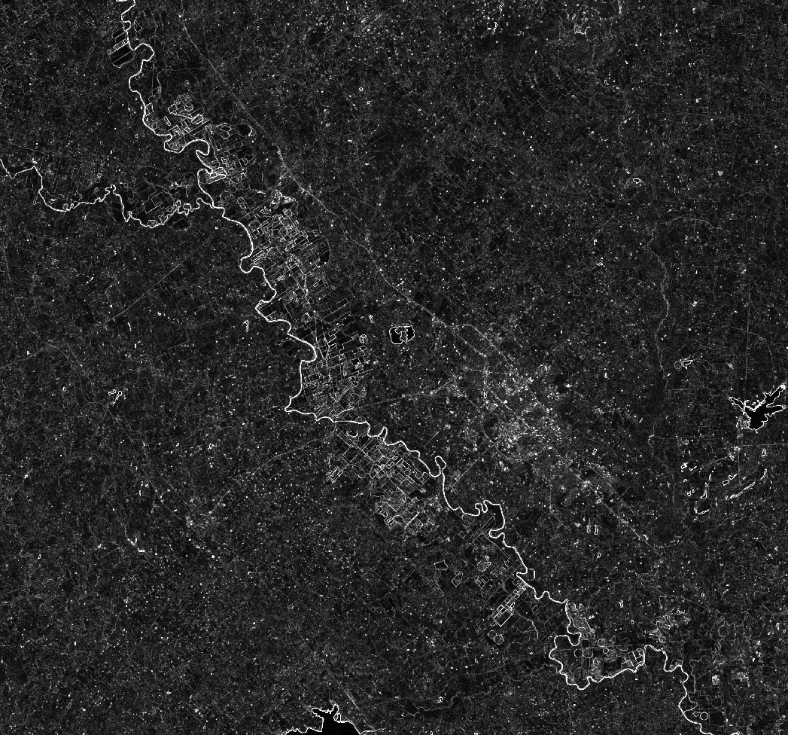
    <figcaption>Standard Deviation of NIR 3x3</figcaption>
  </figure>
  <figure style="margin: 0; text-align: center;">
    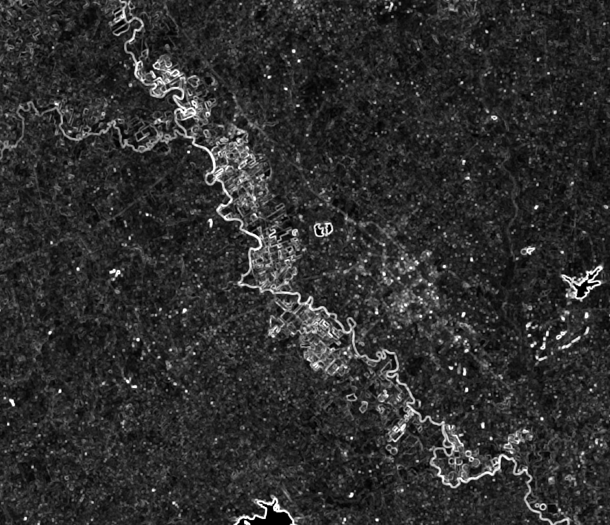
    <figcaption>Standard Deviation of NIR 11x11</figcaption>
  </figure>

### Questions to answer:

- Show the output map of the raster that represents the standard deviation of the `NIR` spectral data.
  - Q1. What information is generated when the metric is used on the `NIR` spectral data?
  - Q2. What does it effectively highlight?
  - Q3. Does the nature of the information change when you change the window size from 3x3 to 11x11?
  - Q4. Speculate on what you think this information could be used for (e.g., a particular application, mapping, assessing the landscape)?

- Show the output map of the raster that represents the standard deviation of the `DEM` data.
  - Q5. What information is generated when the metric is used on the `DEM` data?
  - Q6. What does it effectively highlight?
  - Q7. Does the nature of the information change when you change the window size from 3x3 to 11x11?
  - Q8. Theoretically, what topographic property should the metric characterize?
  - Q9. Speculate on what you think this information could be used for (e.g., a particular application, mapping, assessing the landscape).

## Part 2. Point Distance and Variability Metrics

Steps:

1. Load the `Well Nitrate` data.
2. Filter out the wells that have nitrate concentration greater than 10 ppm, mark as `Well Nitrate Filtered` later.
3. Calculate the `Mean Center` and the `Standard Distance` of both `Well Nitrate` and the `Well Nitrate Filtered` data.
4. Describe, compare, and intepret the results of the `Mean Center` and the `Standard Distance` of the two datasets.

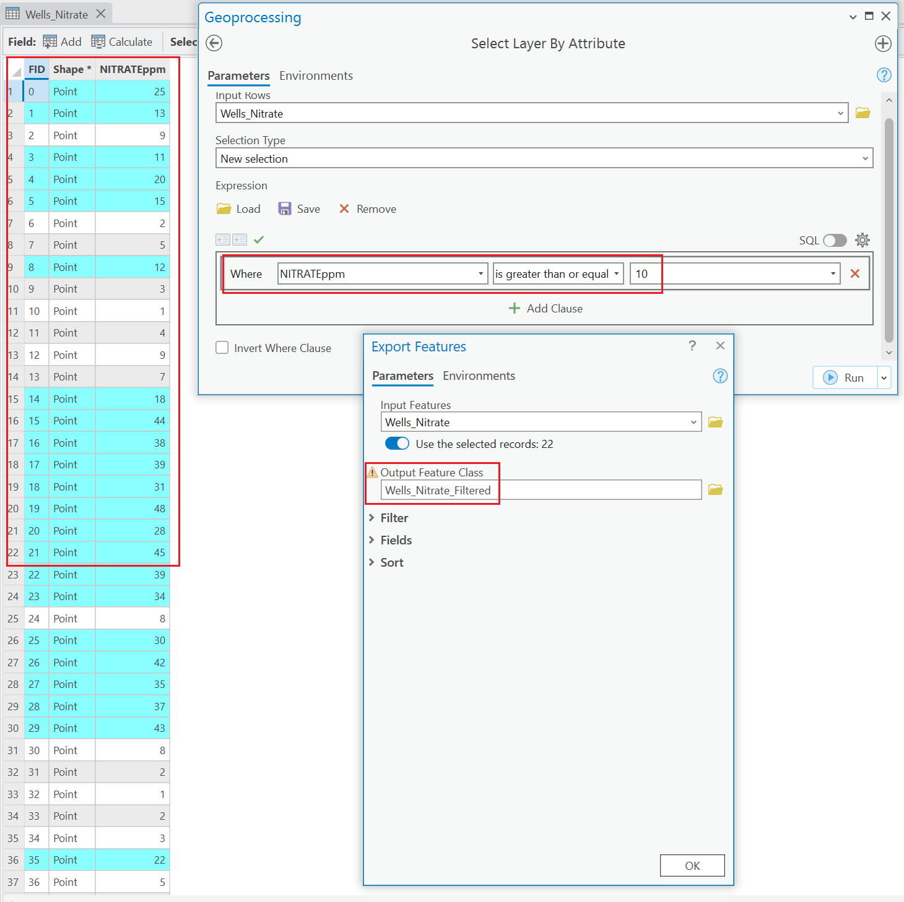

The output should look like:

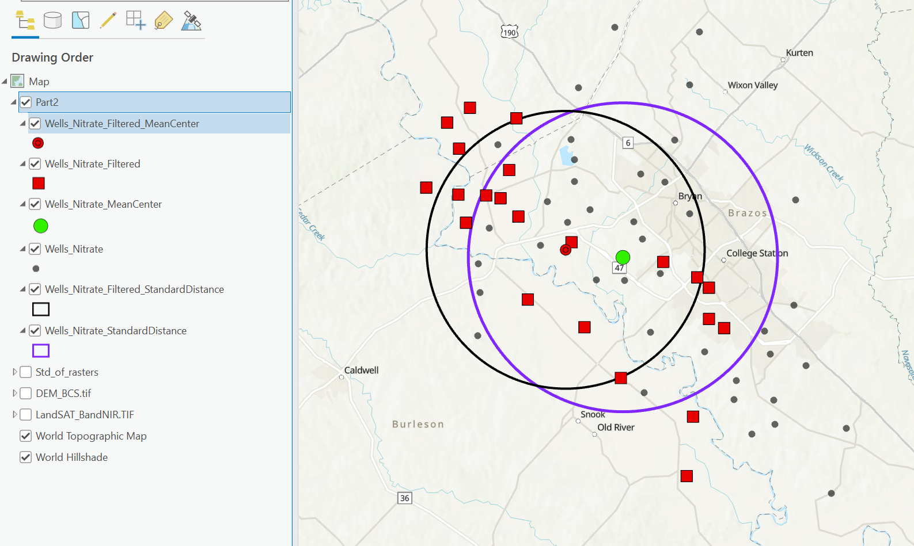

### Questions to answer:

- Show the map of water-well location pattern.
  - Q1. Describe the water-well location pattern across Brazos County using the metrics that you generated.  

- Show the map of water-well location pattern for contaminated wells.
  - Q2. Describe the water-well location pattern for contaminated wells across Brazos County.
  - Q3. Compare and contrast the distribution pattern of all points and the contaminated points.

- Q4. Does the contamination pattern reflect any potential sources of pollution (hint: examine the satellite imagery and examine the land use patterns with their maps)?
