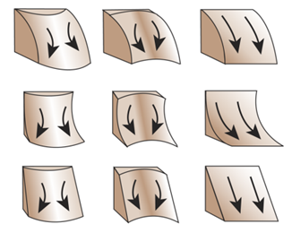
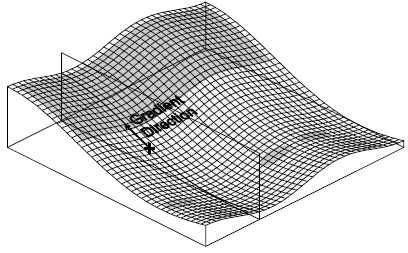
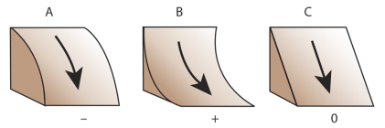
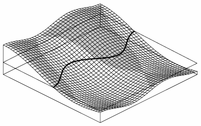
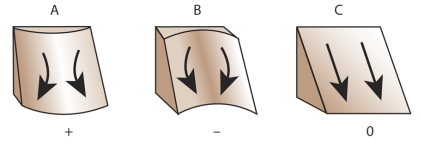
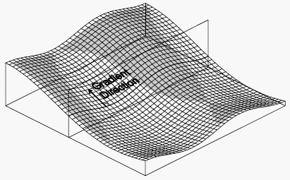

# GEOG 475 Advanced GIS Lab3 - Education Meterial

>**Topic**: Univariate Statistics & Derivatices
>
>**100 points**
>
>**Author:** Zhenlei Song
>
>**Contact:** [songzl@tamu.edu](mailto:songzl@tamu.edu)

## Gradient

The term **`gradient`** refers to a `vector quantity`, i.e. an object that has both `magnitude` and `direction`. The magnitude or size of the gradient is the slope, whilst the direction in which the maximum value of this magnitude occurs is known as the aspect.

Let's take an example of a 2D function `f(x,y)`, the gradient `G` of this function is defined as:
$$
\vec{G} = \nabla f(x,y) = \left(\frac{\partial f}{\partial x}, \frac{\partial f}{\partial y}\right)\\
= \frac{\partial f}{\partial x}\vec{i} + \frac{\partial f}{\partial y}\vec{j}
$$

Where: 
$$
\vec{i} = \begin{pmatrix} 1 \\ 0 \end{pmatrix}, \vec{j} = \begin{pmatrix} 0 \\ 1 \end{pmatrix}
$$

It's a vector quantity, so it has both magnitude and direction. If we split its magnitude and direction, the magnitude of the gradient can be represented in:
$$
|G| = \sqrt{\left(\frac{\partial f}{\partial x}\right)^2 + \left(\frac{\partial f}{\partial y}\right)^2}
$$

The direction of the gradient can be represented as an angle $\theta$ with respect to the x-axis:
$$
\theta = \arctan\left(\frac{\partial f/\partial y}{\partial f/\partial x}\right)
$$

Then if we plot this function $f$'s form on a 2D plane, we can see the gradient vector at each point on the surface.

    <figure style="margin: 0; text-align: center;">
        
        <figcaption>Gradient on 2D plane</figcaption>
    </figure>

But how is the concept of `gradient` related to `slope` and `aspect`?

## First-Order Derivatices -- Slope & Aspect

Slope is one of the most widely used of surface attributes so understanding how it is generated and what alternatives exist is extremely important.

Let's assume the `DEM` as a 2-D function $Z$ on $x,y$

$$
Z = f(x,y)
$$

Then the function form of $f$ becomes familiar. It's just the hillshade of the terrain that `DEM` describes. Then if we apply the `gradient` operator $\nabla$ on this function, the `gradient` of the `DEM` is a `vector`, which can be represented as:
$$
\nabla{Z} = \left(\overrightarrow{\frac{\partial f}{\partial x}}, \overrightarrow{\frac{\partial f}{\partial y}}\right) = \frac{\partial f}{\partial x}\vec{i} + \frac{\partial f}{\partial y}\vec{j}
$$

Then what is the physical meaning of the `magnitude` and `direction` of the gradient of the `DEM` $\nabla{Z}$?

### Slope

Gradient's magnitude of `DEM` is:

$$
||\nabla{Z}|| = \sqrt{\left(\frac{\partial f}{\partial x}\right)^2 + \left(\frac{\partial f}{\partial y}\right)^2}
$$

If we define an angle variable $\alpha$ here:
$$
\alpha = \arctan{\sqrt{\left(\frac{\partial f}{\partial x}\right)^2 + \left(\frac{\partial f}{\partial y}\right)^2}}
$$

So that:
$$
||\nabla{Z}|| = \tan{\alpha}
$$

**This means:**

We can use this angle variable *$\alpha$* to describe the `DEM`'s gradient magnitude, whose physical meaning is just the `slope` angle of the terrain. It's the angle between the `horizontal` plane and the `tangent` plane of the terrain surface.

    <figure style="margin: 0; text-align: center;">
        
        <figcaption>Source Terrain Map</figcaption>
    </figure>
    <figure style="margin: 0; text-align: center;">
        
        <figcaption>Slope Map</figcaption>
    </figure>

Then what about the direction of the gradient?

### Aspect

The direction of the gradient of $Z$ is a `vector`:

$$
\left(\frac{\partial f}{\partial x}, \frac{\partial f}{\partial y}\right)
$$

If we define another angle variable `aspect` angle $A$ here:

$$
A = 270^\circ - \frac{360}{2\pi}\arctan\left(\frac{\partial f/\partial y}{\partial f/\partial x}\right)
$$

`Aspect` is computed in degrees from due north, i.e. as an azimuth in degrees not radians.

    <figure style="margin: 0; text-align: center;">
        
        <figcaption>Source Terrain Map</figcaption>
    </figure>
    <figure style="margin: 0; text-align: center;">
        
        <figcaption>Aspect Map (Classified)</figcaption>
    </figure>

## Second-Order Derivateives -- Curvature

For the elevation model over a 2-D plain, $Z = f(x,y)$, its first-order derivative, which is the `gradient`, is a `vector`. However its second-order derivative on certain directions is a `scalar`:

Let's define a `vector` $\mathbf{s}=u\vec{i}+v\vec{j}$, and the `Second Directional Derivative` of $Z$ on this direction $\mathbf{s}$ is `Quadratic Form` of the `Hessian` matrix and the vector $\mathbf{s}$:

$$
\frac{\partial^2 Z}{\partial s^2} = \mathbf{s^T}\mathbf{H}\mathbf{s}\\
= \begin{bmatrix}
u & v
\end{bmatrix}
\begin{bmatrix}
    f_{xx} & f_{xy} \\
    f_{xy} & f_{yy}
\end{bmatrix}
\begin{bmatrix}
    u \\
    v
\end{bmatrix}\\
= f_{xx}u^2 + 2f_{xy}uv + f_{yy}v^2
$$

Where $f_{xx}=\frac{\partial^2 f}{\partial x^2}$, $f_{y}=\frac{\partial^2 f}{\partial y^2}$, $f_{xy}=f_{yx}=\frac{\partial^2 f}{\partial x \partial y}$.

The `second-order directional derivative` describes how much the function **`bends`** along a given direction, but is computed in `parameter space` and does not take into account the actual aggregate shape of the surface. So we need to perform `normal vector correction` and `unit vector normalization`. The final `curvature` obtained describes only the degree of curvature of the function shape along a certain direction and is `uniformly concave`. **Convexity** is **positive** curvature and **concavity** is **negative** curvature:

$$
\mathbf{K_s} = \frac{f_{xx}u^2 + 2f_{xy}uv + f_{yy}v^2}{(u^2+v^2)^{3/2}}
$$

According to different directional vector $\mathbf{s}$, there are several alternative measures of surface curvature. The three most frequently provided within GIS software are `profile curvature`, `plan curvature` and `tangential curvature`. Additional terms and measures include longitudinal curvature, cross-sectional curvature, maximum and minimum curvature, and mean curvature.

    <figure style="margin: 0; text-align: center;">
        
        <figcaption>Curvature</figcaption>
    </figure>

### Profile Curvature

**`Profile Curvature`**, determines the downhill or uphill rate of change in slope in the `gradient` direction at each grid node. Grid files of Profile Curvature produce contour maps that show isolines of constant rate of change of **steepest** slope across the surface. This operation is comparable to the `Second Directional Derivative` but is more powerful because it automatically determines the downhill direction at each point on the surface, and then determines the rate of change of slope along that direction at that point. Negative values are convex upward and indicate accelerated flow of water over the surface. Positive values are concave upward and indicate slowed flow over the surface.

$$
K_{prof} = -\frac{f_{xx}f_x^2+2f_{xy}f_xf_y+f_{yy}f_y^2}{(f_x^2+f_y^2)(1+f_x^2+f_y^2)^{3/2}}
$$

Where:

- $f_x = \frac{\partial f}{\partial x}$, $f_y = \frac{\partial f}{\partial y}$, $f_{xx} = \frac{\partial^2 f}{\partial x^2}$, $f_{yy} = \frac{\partial^2 f}{\partial y^2}$, $f_{xy} = \frac{\partial^2 f}{\partial x \partial y}$.
- The derectional vector $\mathbf{s}=\left(\frac{f_x}{\sqrt{f_x^2+f_y^2}}, \frac{f_y}{\sqrt{f_x^2+f_y^2}}\right)$ is the gradient vector $\nabla{Z}$.
- The negative sign is added to make the profile curvature positive for `convex` surfaces and negative for `concave` surfaces.

    <figure style="margin: 0; text-align: center;">
        
        <figcaption>Profile Curvature measures the curvature of the surface in the direction of gradient. Negative curvature, shown with a gray fill, indicates a convex upward surface and accelerated water flow.
        </figcaption>
    </figure>

    <figure style="margin: 0; text-align: center;">
        
        <figcaption>Profile Curvature</figcaption>
    </figure>

### Planform Curvature

**`Plan Curvature`**, reflects the rate of change of the `Terrain Aspect angle` measured in the `horizontal plane`, and is a measure of the curvature of contours. **Positive** values indicate **divergent** water flow over the surface, and **negative** values indicate **convergent** flow.

$$
K_{plan} = \frac{f_{xx}f_y^2-2f_{xy}f_xf_y+f_{yy}f_x^2}{(f_x^2+f_y^2)(1+f_x^2+f_y^2)^{3/2}}
$$

Where:

- $f_x = \frac{\partial f}{\partial x}$, $f_y = \frac{\partial f}{\partial y}$, $f_{xx} = \frac{\partial^2 f}{\partial x^2}$, $f_{yy} = \frac{\partial^2 f}{\partial y^2}$, $f_{xy} = \frac{\partial^2 f}{\partial x \partial y}$.
- The derectional vector $\mathbf{s}=\left(-\frac{f_y}{\sqrt{f_x^2+f_y^2}}, \frac{f_x}{\sqrt{f_x^2+f_y^2}}\right)$ is the contour direction, i.e. the horizontal direction perpendicular to the gradient direction.

    <figure style="margin: 0; text-align: center;">
        
        <figcaption>Plan Curvature calculates the curvature of the surface in the horizontal plane, or the curvature of the contour. Negative curvature, shown with a gray fill, indicates areas of divergent flow.
        </figcaption>
    </figure>

    <figure style="margin: 0; text-align: center;">
        
        <figcaption>Plan Curvature
        </figcaption>
    </figure>

### Tangential Curvature

**`Tangential Curvature`**, measures `curvature` in relation to a `vertical plane` **perpendicular** to the **`gradient`** direction, or `tangential` to the `contour`. The **negative** and **positive** areas are the same as for Plan Curvature, but the curvature values are different. Tangential Curvature is related to the Plan Curvature KHby the sine of the slope:

$$
K_{tang} = \frac{f_{xx}f_y^2-2f_{xy}f_xf_y+f_{yy}f_x^2}{(f_x^2+f_y^2)\sqrt{1+f_x^2+f_y^2}}
$$

Where:

- $f_x = \frac{\partial f}{\partial x}$, $f_y = \frac{\partial f}{\partial y}$, $f_{xx} = \frac{\partial^2 f}{\partial x^2}$, $f_{yy} = \frac{\partial^2 f}{\partial y^2}$, $f_{xy} = \frac{\partial^2 f}{\partial x \partial y}$.
- The derectional vector $\mathbf{s}$ is the deirection perpendicular to the gradient direction.

    <figure style="margin: 0; text-align: center;">
        
        <figcaption>Tangential Curvature measures the curvature of the surface in the vertical plane perpendicular to the gradient direction. Negative curvature, displayed with gray fill, indicates divergent flow conditions.
        </figcaption>
    </figure>

## References

- [Gradient, slope, and aspect by Spatial Analysis Online](https://spatialanalysisonline.com/HTML/gradient__slope_and_aspect.htm)
- [Vector Calculus: Understanding the Gradient](https://betterexplained.com/articles/vector-calculus-understanding-the-gradient/#:~:text=The%20gradient%20is%20a%20fancy,a%20function%20(intuition%20on%20why))
- [Terrain Attributes- RichDEM](https://richdem.readthedocs.io/en/latest/terrain_attributes.html)
- [Curvature - ArcGIS](https://pro.arcgis.com/en/pro-app/3.3/help/analysis/raster-functions/curvature-function.htm)
- [Curvature-Profile](https://surferhelp.goldensoftware.com/gridops/profile_curvature.htm)
- [Curvature-Plan](https://surferhelp.goldensoftware.com/gridops/plan_curvature.htm)
- [Curvature-Tangential](https://surferhelp.goldensoftware.com/gridops/tangential_curvature.htm)
