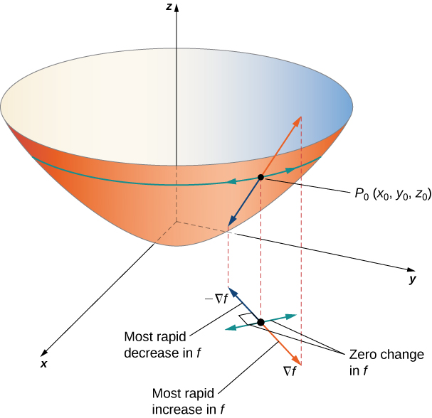
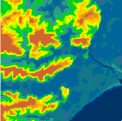
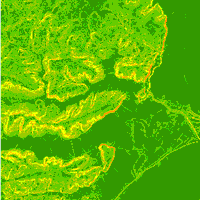

# GEOG 475 Advanced GIS Lab3 - Education Meterial

>**Topic**: Univariate Statistics & Derivatices
>
>**100 points**
>
>**Author:** Zhenlei Song
>
>**Contact:** [songzl@tamu.edu](mailto:songzl@tamu.edu)

## Gradient

The term **`gradient`** refers to a `vector quantity`, i.e. an object that has both `magnitude` and `direction`. The magnitude or size of the gradient is the slope, whilst the direction in which the maximum value of this magnitude occurs is known as the aspect.

Let's take an example of a 2D function `f(x,y)`, the gradient `G` of this function is defined as:
$$
\vec{G} = \nabla f(x,y) = \left(\frac{\partial f}{\partial x}, \frac{\partial f}{\partial y}\right)\\
= \frac{\partial f}{\partial x}\vec{i} + \frac{\partial f}{\partial y}\vec{j}
$$

Where: 
$$
\vec{i} = \begin{pmatrix} 1 \\ 0 \end{pmatrix}, \vec{j} = \begin{pmatrix} 0 \\ 1 \end{pmatrix}
$$

It's a vector quantity, so it has both magnitude and direction. If we split its magnitude and direction, the magnitude of the gradient can be represented in:
$$
|G| = \sqrt{\left(\frac{\partial f}{\partial x}\right)^2 + \left(\frac{\partial f}{\partial y}\right)^2}
$$

The direction of the gradient can be represented as an angle $\theta$ with respect to the x-axis:
$$
\theta = \arctan\left(\frac{\partial f/\partial y}{\partial f/\partial x}\right)
$$

Then if we plot this function $f$'s form on a 2D plane, we can see the gradient vector at each point on the surface.

    <figure style="margin: 0; text-align: center;">
        
        <figcaption>Gradient on 2D plane</figcaption>
    </figure>

But how is the concept of `gradient` related to `slope` and `aspect`?

## First-Order Derivatices -- Slope & Aspect

Slope is one of the most widely used of surface attributes so understanding how it is generated and what alternatives exist is extremely important.

Let's assume the `DEM` as a 2-D function $Z$ on $x,y$

$$
Z = f(x,y)
$$

Then the function form of $f$ becomes familiar. It's just the hillshade of the terrain that `DEM` describes. Then if we apply the `gradient` operator $\nabla$ on this function, what is the physical meaning of the `magnitude` and `direction` of the gradient of the `DEM`?

### Slope

Gradient's magnitude of `DEM` is:

$$
||\nabla{Z}|| = \sqrt{\left(\frac{\partial f}{\partial x}\right)^2 + \left(\frac{\partial f}{\partial y}\right)^2}
$$

If we define an angle variable $\alpha$ here:
$$
\alpha = \arctan{\sqrt{\left(\frac{\partial f}{\partial x}\right)^2 + \left(\frac{\partial f}{\partial y}\right)^2}}
$$

So that:
$$
||\nabla{Z}|| = \tan{\alpha}
$$

**This means:**

We can use this angle variable *$\alpha$* to describe the `DEM`'s gradient magnitude, whose physical meaning is just the `slope` angle of the terrain. It's the angle between the `horizontal` plane and the `tangent` plane of the terrain surface.

    <figure style="margin: 0; text-align: center;">
        
        <figcaption>Source Terrain Map</figcaption>
    </figure>
    <figure style="margin: 0; text-align: center;">
        
        <figcaption>Slope Map</figcaption>
    </figure>

Then what about the direction of the gradient?

### Aspect

The direction of the gradient of $Z$ is a `vector`:

$$
\left(\frac{\partial f}{\partial x}, \frac{\partial f}{\partial y}\right)
$$

If we define another angle variable `aspect` angle $A$ here:

$$
A = 270^\circ - \frac{360}{2\pi}\arctan\left(\frac{\partial f/\partial y}{\partial f/\partial x}\right)
$$

`Aspect` is computed in degrees from due north, i.e. as an azimuth in degrees not radians.

    <figure style="margin: 0; text-align: center;">
        
        <figcaption>Source Terrain Map</figcaption>
    </figure>
    <figure style="margin: 0; text-align: center;">
        
        <figcaption>Aspect Map (Classified)</figcaption>
    </figure>

## Second-Order Derivateives -- Curvature

As with `slope`, `curvature` values depend upon the line or plane along which such calculations are made. There are several alternative measures of surface curvature. The three most frequently provided within GIS software are `profile curvature`, `plan curvature` and `tangential curvature`. Additional terms and measures include longitudinal curvature, cross-sectional curvature, maximum and minimum curvature, and mean curvature.

### Profile Curvature

Profile curvature is the curvature of the surface in the direction of maximum slope. It is a measure of how much the slope changes along the direction of maximum slope. It is calculated as:

$$
K_p = \frac{\partial^2 Z}{\partial s^2}
$$

Where $s$ is the distance along the direction of maximum slope.

### Plan Curvature

Plan curvature is the curvature of the surface perpendicular to the direction of maximum slope. It is a measure of how much the slope changes in a direction perpendicular to the direction of maximum slope. It is calculated as:
$$
K_{pl} = \frac{\partial^2 Z}{\partial n^2}
$$

Where $n$ is the distance perpendicular to the direction of maximum slope.

### Tangential Curvature

Tangential curvature is the curvature of the surface in the direction of the tangent to the slope. It is a measure of how much the slope changes along the direction of the tangent to the slope. It is calculated as:

$$
K_t = \frac{\partial^2 Z}{\partial t^2}
$$

Where $t$ is the distance along the direction of the tangent to the slope.

## References

- [Gradient, slope, and aspect by Spatial Analysis Online](https://spatialanalysisonline.com/HTML/gradient__slope_and_aspect.htm)
- [Vector Calculus: Understanding the Gradient](https://betterexplained.com/articles/vector-calculus-understanding-the-gradient/#:~:text=The%20gradient%20is%20a%20fancy,a%20function%20(intuition%20on%20why))
- [Terrain Attributes- RichDEM](https://richdem.readthedocs.io/en/latest/terrain_attributes.html)
