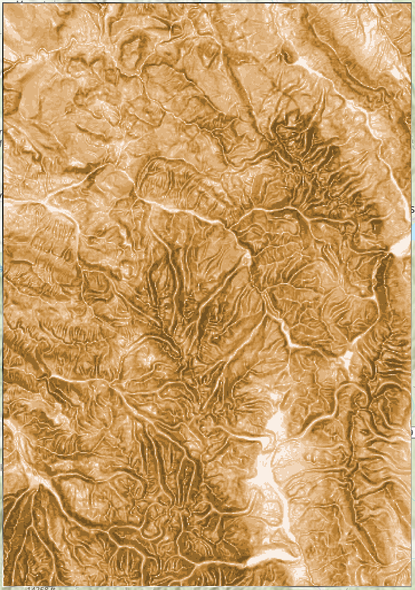
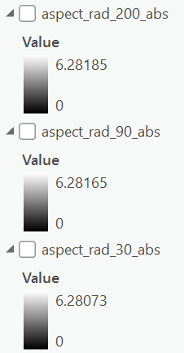
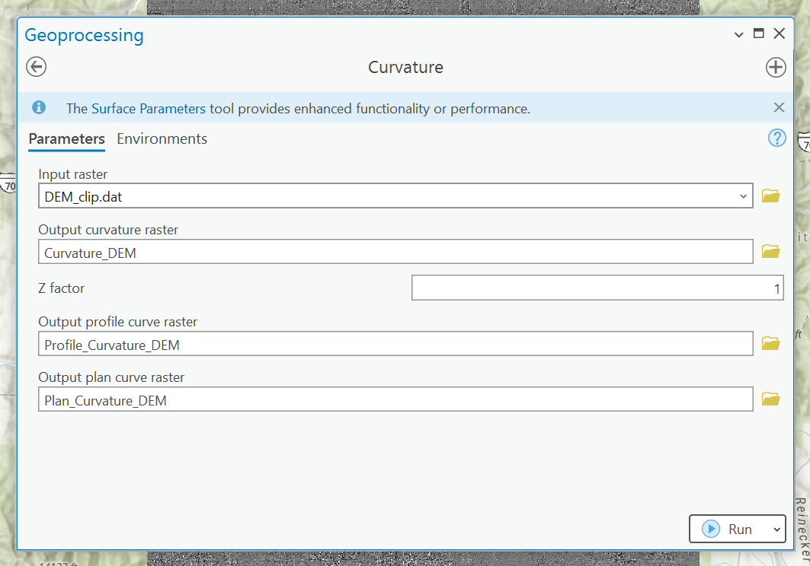
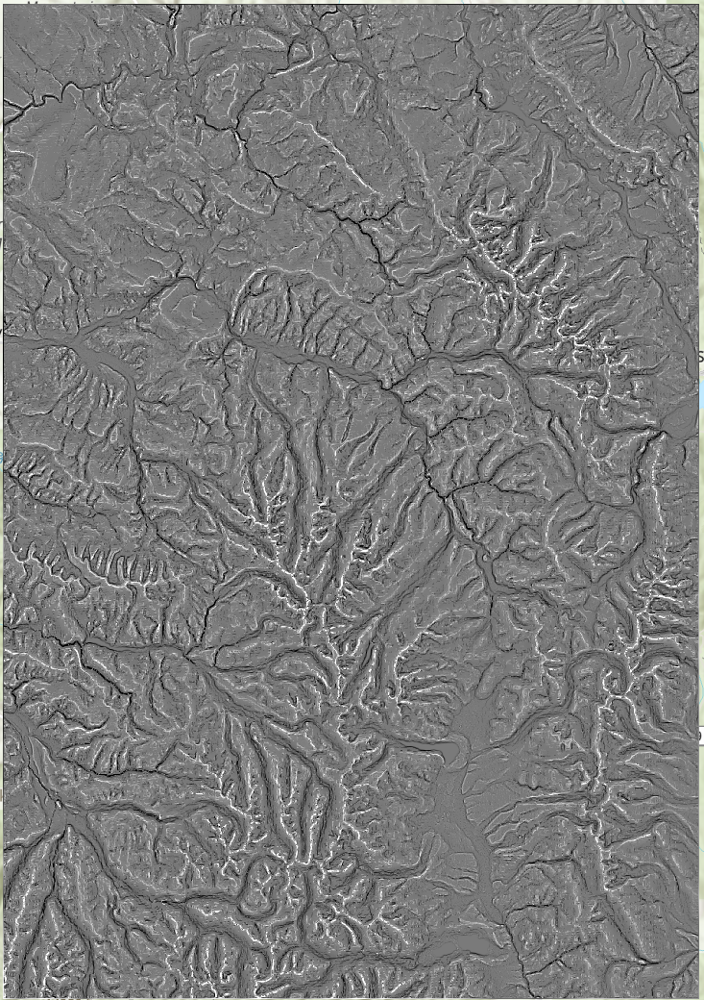

# GEOG 475 Advanced GIS Lab3 - Technical Meterial

>**Topic**: Univariate Statistics & Derivatices
>
>**100 points**
>
>**Author:** Zhenlei Song
>
>**Contact:** [songzl@tamu.edu](mailto:songzl@tamu.edu)

## Dataset Preview

### **Digital Elevation Model (DEM)**

Digital Elevation Model (DEM) data of **Park Range**, northwest of Colorado. The data includes elevation values in meters.

  <figure style="margin: 0; text-align: center;">
    
    <figcaption>DEM Data Preview</figcaption>
  </figure>

## Part 1. Univariate Statistics

### **Steps:**

1. Load the 30m, 90m, and 200m DEMs (choose the 90m and 200 DEM derived from the same resampling algorithm in `Lab1`) and compute the following zonal statistics over a polygon created by yourself:
   - `Minimum`
   - `Maximum`
   - `Mean`
   - `Standard Deviation`
    
2. Create a table that compiles these statistics with the column labels representing the statistics, and the row labels representing the DEM resolution (e.g., `DEM30`, `DEM90`, `DEM200`). Then merge these 3 tables into one.
    
3. Then use the focal statistics to generate a `relief map` ($z_{max} - z_{min}$) (can also use `range` directly) and `standard deviation` map by a **`3x3`** sliding window region.

  <figure style="margin: 0; text-align: center;">
    
    <figcaption>Get the Relief Map using Focal Stats</figcaption>
  </figure>
  <figure style="margin: 0; text-align: center;">
    
    <figcaption>Get the Relief Map using Raster Calculater</figcaption>
  </figure>

  <figure style="margin: 0; text-align: center;">
    
    <figcaption>Get the Std Map using Focal Stats</figcaption>
  </figure>

### **Flowchart:**

### **Expected Results:**

- The table you merged from 3 tables from `Step 1&2` should look like this:
    

- The output of the `relief map` and `standard deviation` map should look like this:

  <figure style="margin: 0; text-align: center;">
    
    <figcaption>Relief Map of 30m DEM</figcaption>
  </figure>
  <figure style="margin: 0; text-align: center;">
    
    <figcaption>Relief Map of 90m DEM</figcaption>
  </figure>
  <figure style="margin: 0; text-align: center;">
    
    <figcaption>Relief Map of 200m DEM</figcaption>
  </figure>

  <figure style="margin: 0; text-align: center;">
    
    <figcaption>Std Map of 30m DEM</figcaption>
  </figure>
  <figure style="margin: 0; text-align: center;">
    
    <figcaption>Std Map of 90m DEM</figcaption>
  </figure>
  <figure style="margin: 0; text-align: center;">
    
    <figcaption>Std Map of 200m DEM</figcaption>
  </figure>

### **Experimental Questions:**

1. To what degree does the grid resolution influence the magnitude of the statistics (`minimum`, `maximum`, `mean`, and `standard deviation`)?
   - Provide the statistics result as a table
   - explain the reasons for your results.

2. Examine the `relief/range` and `standard deviation maps`.
   - Describe the `spatial distribution` of those parameters/properties (e.g., what areas are highlighted by the largest values).

## Part 2. First Order Derivatives

### **Steps:**

1. Load your `30m (original)`, `90m`, and `200m` DEMs.
2. Generate `slope angle` and `slope-azimuth` (aspect) maps for each DEM.

    

        <figure style="margin: 0; text-align: center;">
            
            <figcaption>Slope of DEM</figcaption>
        </figure>
        <figure style="margin: 0; text-align: center;">
            
            <figcaption>Slope Azimuth (Aspect) of DEM</figcaption>
        </figure>
    

3. Randomly select a few (more than 5) `points` to extract `slope angles` and `slope-azimuth angle` values for each location for all DEMs.
    

        <figure style="margin: 0; text-align: center;">
            
            <figcaption>The points you pick</figcaption>
        </figure>
    

   - Extract multiple values to points into a table that depicts the `magnitude` of the values for each grid resolution and each coordinate point.
    

        <figure style="margin: 0; text-align: center;">
            
            <figcaption>Extract Values</figcaption>
        </figure>
    

   - Each row of this table should represent a `coordinate point`, and the columns should represent the `DEM resolution` and the `slope angle` and `slope-azimuth angle` values.
    

        <figure style="margin: 0; text-align: center;">
            
            <figcaption>Attribute Table of the point layer</figcaption>
        </figure>
    

4. Generate an analytical `relief-shaded` map using `slope` and `slope-azimuth` angles (aspect).
   - Before you get into the equation, **CONVERT all `slope` and `aspect` values from `DEGREE` into `RADIAN`** unit. The conversion equation is:
        $$\text{radian} = \text{degree} \times \frac{\pi}{180}$$
    **NOTE**: The `aspect` values in `radian` can be **`NEGATIVE`**, so you need to convert all **`NEGATIVE`** values to **`POSITIVE`**.
    

        <figure style="margin: 0; text-align: center;">
            
            <figcaption>Convert from degrees to radians</figcaption>
        </figure>
        <figure style="margin: 0; text-align: center;">
            
            <figcaption>Convert negative aspects (in radian) into positives</figcaption>
        </figure>
    

   - Take involves computing which examines the relationship between `solar` and `terrain` geometry. It is computed as:
        $$\cos{i} = \cos{\theta_s}\cos{\theta_t} + \sin{\theta_s}\sin{\theta_t}\cos{(\phi_s - \phi_t)}$$
        where:
        - $\theta_s$ is the `solar zenith` angle
        - $\theta_t$ is the `terrain slope` angle, it comes from the `slope` map
        - $\phi_s$ is the `solar azimuth` angle
        - $\phi_t$ is the `slope-azimuth` angle (aspect), it comes from the `aspect` map
    **NOTE:** all `angle` values here should be in `radian` unit. You should pick at least 3 different `zenith` and 4 different `azimuth` values to generate the `relief-shaded` map.
    

        <figure style="margin: 0; text-align: center;">
            
            <figcaption>Attribute Table of the point layer</figcaption>
        </figure>
    

### **Flowchart:**

### **Expected Results:**

1. `Slope` and `Aspect` results in degree unit:
    

        <figure style="margin: 0; text-align: center;">
            
            <figcaption>30m DEM Slope in degree unit</figcaption>
        </figure>
        <figure style="margin: 0; text-align: center;">
            
            <figcaption>90m DEM Slope in degree unit</figcaption>
        </figure>
        <figure style="margin: 0; text-align: center;">
            
            <figcaption>200m DEM Slope in degree unit</figcaption>
        </figure>
    

    

        <figure style="margin: 0; text-align: center;">
            
            <figcaption>30m DEM Aspect in degree unit</figcaption>
        </figure>
        <figure style="margin: 0; text-align: center;">
            
            <figcaption>90m DEM Aspect in degree unit</figcaption>
        </figure>
        <figure style="margin: 0; text-align: center;">
            
            <figcaption>200m DEM Aspect in degree unit</figcaption>
        </figure>
    

2. `Slope` and `Aspect` results in radian unit:
    

        <figure style="margin: 0; text-align: center;">
            
            <figcaption>30m DEM Slope in radian unit</figcaption>
        </figure>
        <figure style="margin: 0; text-align: center;">
            
            <figcaption>90m DEM Slope in radian unit</figcaption>
        </figure>
        <figure style="margin: 0; text-align: center;">
            
            <figcaption>200m DEM Slope in radian unit</figcaption>
        </figure>
    

    

        <figure style="margin: 0; text-align: center;">
            
            <figcaption>30m DEM Aspect in radian unit</figcaption>
        </figure>
        <figure style="margin: 0; text-align: center;">
            
            <figcaption>90m DEM Aspect in radian unit</figcaption>
        </figure>
        <figure style="margin: 0; text-align: center;">
            
            <figcaption>200m DEM Aspect in radian unit</figcaption>
        </figure>
    

    

        <figure style="margin: 0; text-align: center;">
            
            <figcaption>30m DEM Aspect in radian unit (all postive)</figcaption>
        </figure>
        <figure style="margin: 0; text-align: center;">
            
            <figcaption>90m DEM Aspect in radian unit (all postive)</figcaption>
        </figure>
        <figure style="margin: 0; text-align: center;">
            
            <figcaption>200m DEM Aspect in radian unit (all postive)</figcaption>
        </figure>
    

3. The value ranges of `Slope` and `Aspect` layers before and after converting to radian. **To prove you convert them and get rid of the negative values**
   

        <figure style="margin: 0; text-align: center;">
            
            <figcaption>Value Range of Slope in degree</figcaption>
        </figure>
        <figure style="margin: 0; text-align: center;">
            
            <figcaption>Value range of Aspects in degree</figcaption>
        </figure>
    

    

        <figure style="margin: 0; text-align: center;">
            
            <figcaption>Value Range of Slope in radian</figcaption>
        </figure>
        <figure style="margin: 0; text-align: center;">
            
            <figcaption>Value range of Aspects in radian</figcaption>
        </figure>
        <figure style="margin: 0; text-align: center;">
            
            <figcaption>Value Range of Aspects in radian (all positives)</figcaption>
        </figure>
    

4. Extracted Values Attribute Table:
    
5. Analytical `relief-shaded` map
    

        <figure style="margin: 0; text-align: center;">
            
            <figcaption>Example of relief-shaded map of DEM using zenith of 45 deg, and azimuth of 180 deg</figcaption>
        </figure>
    

### **Experimental Questions:**

1. Examine the `spatial distribution` of `slope` and `slope-azimuth` angles  (aspect) based on DEM30, 90, and 200 over the study area with screenshots of your results.  
   - Can you see much difference in spatial patterns given the measurement scale of the DEM (DEM30, 90, and 200)?

2. Compare and contrast the magnitude of `slope` angle and `slope-azimuth` values (aspect) in your table as a function of grid cell size.
   - Do the values exhibit magnitude differences?
   - Do you see any trends?  
   - Provide examples and explain the reasons for your results.

3. Which geomorphometric parameter (given the parameters, i.e., `solar zenith` angle and `solar azimuth` angle, that you have generated) would you tell someone else to use if they wanted to effectively visualize the spatial structure of the topography?
   - Provide comparative image/map evidence to support your conclusion.
   - **Hint:** Try multiple combination of `solar zenith` and `solar azimuth` angles to generate the `relief-shaded` map.

## Part 3. Second Order Derivatives

### **Steps:**

1. Load your `30m (original)` DEMs.
2. Generate `profile` and `tangential` (plan) curvature maps.
   
3. Examine the spatial distribution of curvature over the landscape.

### **Flowchart:**

### **Expected Results:**

1. `Profile` and `Tangential` curvature maps:
    

        <figure style="margin: 0; text-align: center;">
            
            <figcaption>Profile Curvature Map</figcaption>
        </figure>
        <figure style="margin: 0; text-align: center;">
            
            <figcaption>Tangential Curvature Map</figcaption>
        </figure>
    

### **Experimental Questions:**

1. What `features` or `terrain characteristics` are highlighted using `profile` curvature based on the map you got (highlighted could mean extremely high or low values on the landscape)?

2. What `features` or `terrain characteristics` are highlighted using `tangential` (plan) curvature based on the map you got (highlighted could mean extremely high or low values on the landscape)?

3. Do `profile` and `tangential` curvature maps produce unique information about the landscape compared to the other metrics that you have generated, i.e., `relief/range`, `standard deviation`, `slope`, `aspect`, and `relief-shaded`?  
   - Provide qualitative and quantitative evidence for this with screenshots of your results.

## Due Date:

- Section 501 (Monday Section): Mar 17 at 11:59pm
- Section 504 (Thursday Section): Mar 20 at 11:59pm

## Submission:

### What to submit:

A `.doc/docx` file that includes:

- Contextx and necessary screenshots (with captions) to prove you finished all the required steps.
  - refer to the `results` subsections in each part.
- Well-supported answers to all questions in each part.
  - You need to justify your answers with quantitative evidence and figures if needed.

### Where to submit:

Through this [canvas link](https://canvas.tamu.edu/courses/358912/assignments/2411085?module_item_id=11888959).

## Grading Policy:

- 50%: **Follow the instructions and show intermediate results by screenshots**
  
- 40%: **Answer questions for each subsections and justify your answers with quantitative evidence and figures if needed**
  
- 10%: **Show justification for your parameter tuning from the aspect of formulas and characteristics of the algorithms**