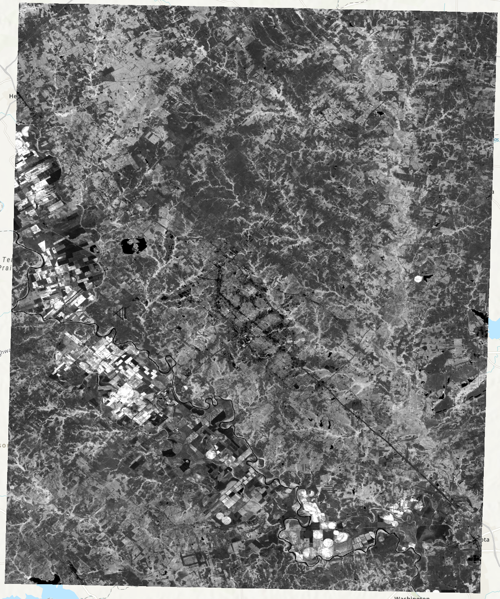
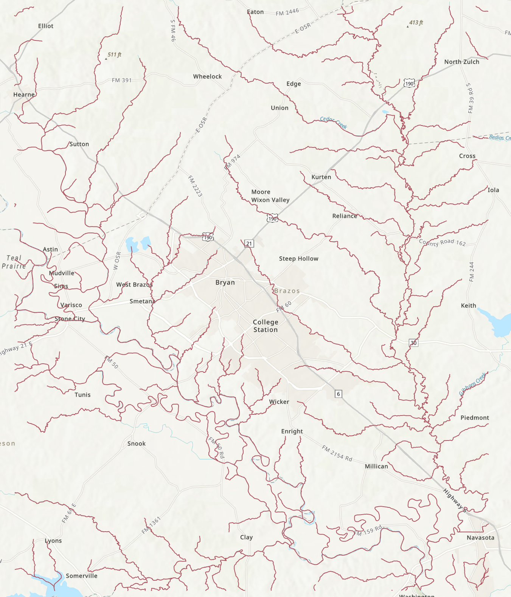
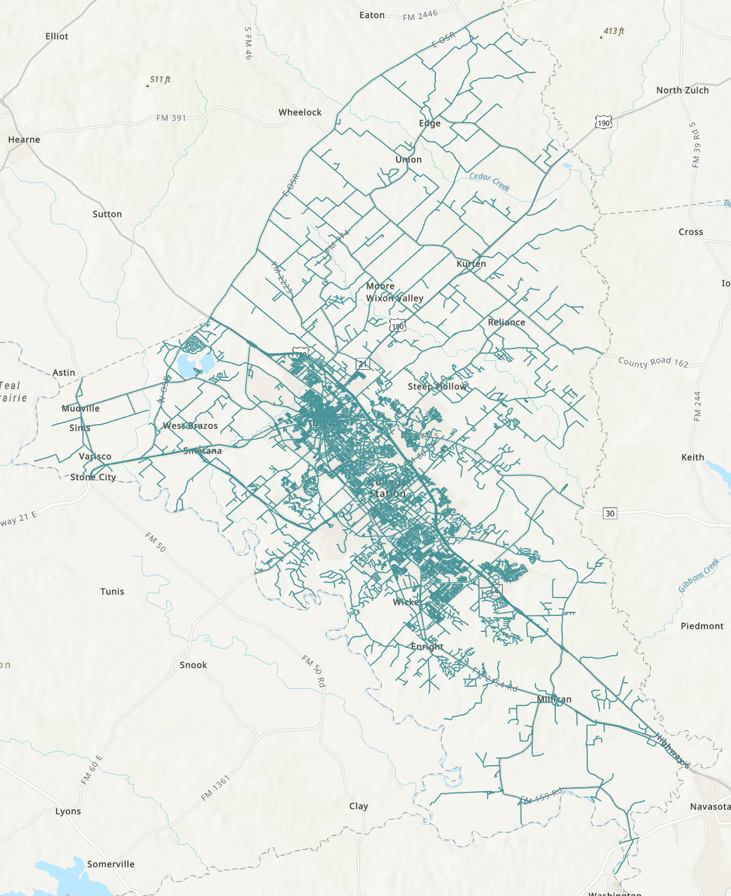
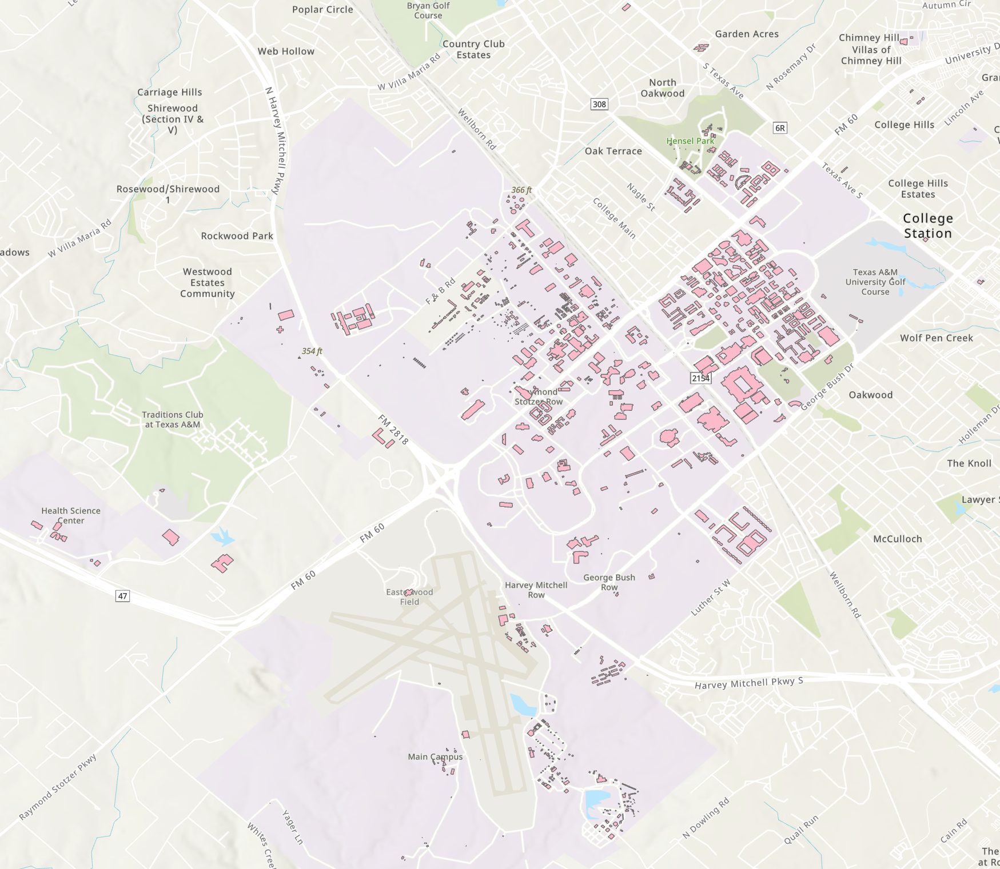
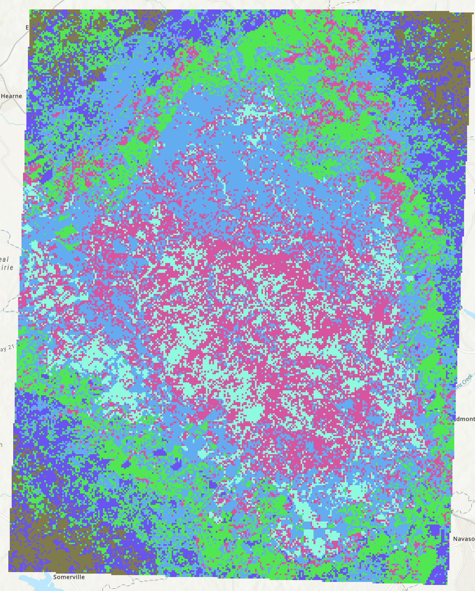

# GEOG 475 Advanced GIS Lab4 - Technical Meterial

>**Topic**: Criteria Based Modeling
>
>**100 points**
>
>**Author:** Zhenlei Song
>
>**Contact:** [songzl@tamu.edu](mailto:songzl@tamu.edu)

## TASK

> You are retiring and want to move back to the beautiful town where you went to college, College Station, Texas. You want to find a place to build your own house that meets your and your family's needs.
> Some criteria you have in mind are:
>
> - It won't be affected by flooding.
> - It is close enough to hiking trails and fresh air (exposed to vegatation).
> - It's close to the current road network so that you don't have to build a long driveway.
> - It's not too far away from Texas A&M University (TAMU) campus. So that your child can go to school there (you have burnt their UT offer letter).

## Dataset Preview

### DEM

### NDVI

### River

### Road Network

### University Building Structures

## Steps

### Criteria Definition

At the end of every criteria map, you need to `Reclassify` the layer to a `suitability` index, value from `1` to `6` (Not suitable to Excellent Suitable). **BE AWARE**
> *Do people prefer this criteria's value to be high or low?*
> *How do you define the value range of each category for each criteria?*

#### Flooding

Create a flood map based on altitude variations (`DEM`) and proximity to streams (use `River`), such that all altitudes within a localized altitude range are flooded.

Follow the steps below:

- Find the `maximum` and the `minimum` elevation of the `DEM` raster. Set a fixed thereshold of gauge value as the `flood level`. Filter the `DEM` raster to find the areas that are below the `flood level`.
- Tune the `flood level` until you think that the flooding zones seem reasonable and are restricted to river/stream floodplains.
- Build a buffer on the `River` layer.
- The intersection of the output from the steps (2) and (3) is the `Flooding` map.
- Reclassify the `Flooding` map to a `suitability` index, value from `1` to `6` (Not suitable to Excellent Suitable).

#### Vegatation

- Reclassify the `NDVI` layer to a `suitability` index, value from `1` to `6` (Not suitable to Excellent Suitable).

#### Road Accessibility

- Load the `Road` polyline layer and calculate the `Euclidean Distance` to the nearest road as a raster layer.
- Reclassify the `Distance to Road` layer to a `suitability` index, value from `1` to `6` (Not suitable to Excellent Suitable).

#### Distance to University

- Load the `Building Structures` polygon layer and calculate the `Euclidean Distance` to the nearest building as a raster layer.
- Reclassify the `Distance to University` layer to a `suitability` index, value from `1` to `6` (Not suitable to Excellent Suitable).

### Weighting

After you have created the `criteria maps`, you need to assign weights to each of them. A few things to be aware of:

- The weights should add up to `1`. Or you can normalize the weighted sum to `1` after the calculation.
- The weights assignments can be arbitraty by your preference. But you need to justify your choice of weights.
- Use the formula below to calculate the `suitability` index for each cell in the raster:

$$
  Q_{i}^{WSM} = \frac{\sum_{j=1}^{n} \omega_{i,j} x_j}{\sum_{j=1}^{n} \omega_{i,j}}
$$

Here is an example of how the result should look like:

## Experimental Questions

1. Develop your conceptual workflow that highlights data, processing, suitability ranking and suitability-site modeling. 

2. Justify your choice of data and processing for producing each criteria map.

3. How did you rank your criteria maps?

4. How can you justify the weights that you used in your model?

5. Do different weights produce different index results?

6. Do you think that the suitability-site model accurately represents the best location to build your home in Brazos County?  Explain the reasons behind your answer.

7. If you had to do it all over again (please don't do this), what would you do differently?

## Possible Tools to Use

### In ArcGIS Pro

- Raster Calculator:  [Documentation](https://pro.arcgis.com/en/pro-app/latest/tool-reference/spatial-analyst/raster-calculator.htm)
- Euclidean Distance: [Documentation](https://pro.arcgis.com/en/pro-app/latest/tool-reference/spatial-analyst/euclidean-distance.htm)
- Reclassify: [Documentation](https://pro.arcgis.com/en/pro-app/latest/tool-reference/spatial-analyst/reclassify.htm)
- Buffer: [Documentation](https://pro.arcgis.com/en/pro-app/latest/tool-reference/analysis/buffer.htm)
- Raster to Polygon: [Documentation](https://pro.arcgis.com/en/pro-app/latest/tool-reference/conversion/raster-to-polygon.htm)
- Weighted Overlay: [Documentation](https://pro.arcgis.com/en/pro-app/latest/tool-reference/spatial-analyst/weighted-overlay.htm)

### To draw the flowchart

- [Lucid Chart](https://www.lucidchart.com/pages/)
- [Draw.io](https://app.diagrams.net/)

## Due Date

- Section 501 (Monday Section): Apr 14 at 11:59pm
- Section 504 (Thursday Section): Apr 17 at 11:59pm

## Submission

### What to submit

A `.doc/docx` file that includes:

- Contextx and necessary screenshots (with captions) to prove you finished all the required steps.
  - refer to the `results` subsections in each part.
- Well-supported answers to all questions in each part.
  - You need to justify your answers with quantitative evidence and figures if needed.

### Where to submit:

Through this [canvas link](https://canvas.tamu.edu/courses/358912/assignments/2411086).

## Grading Policy:

- 50%: **Follow the instructions and show intermediate results by screenshots**
  
- 40%: **Answer questions for each subsections and justify your answers with quantitative evidence and figures if needed**
  
- 10%: **Show justification for your parameter tuning from the aspect of formulas and characteristics of the algorithms**