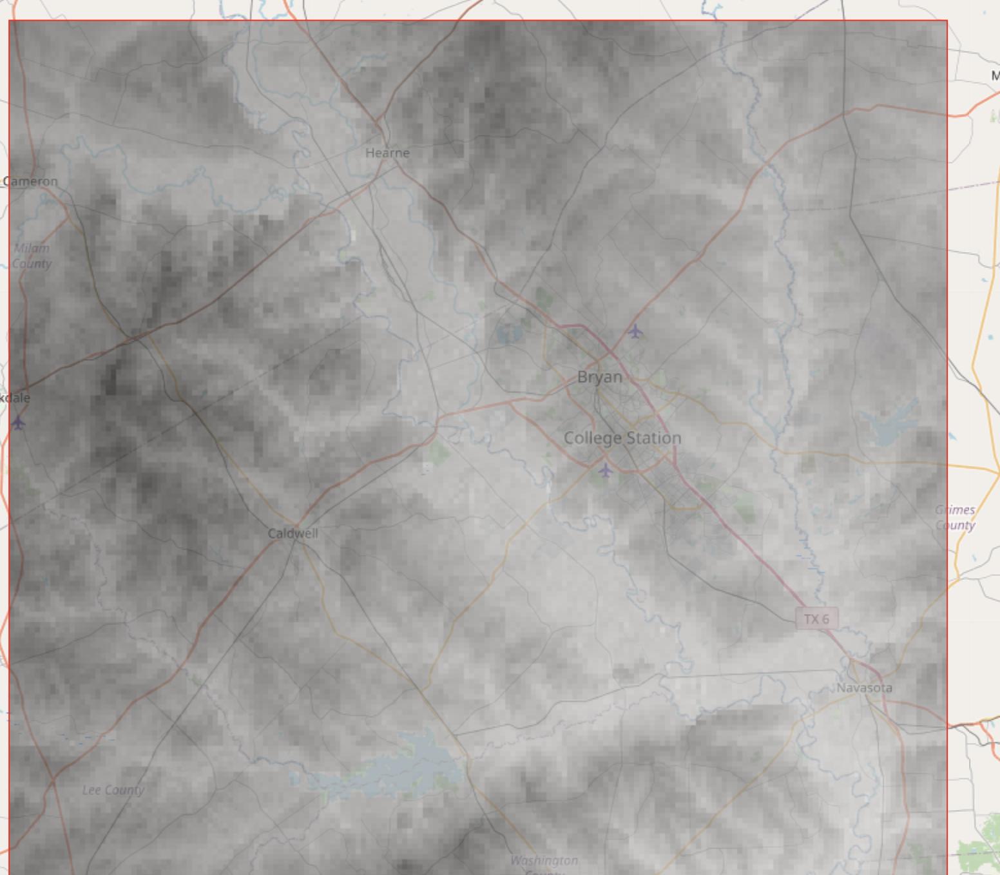

# GEOG 475 Advanced GIS Lab4 - Technical Meterial

>**Topic**: Criteria Based Modeling
>
>**100 points**
>
>**Author:** Zhenlei Song
>
>**Contact:** [songzl@tamu.edu](mailto:songzl@tamu.edu)

## TASK

> You are retiring and want to move back to the beautiful town where you went to college, College Station, Texas. You want to find a place to build your own house that meets your and your family's needs.
> Some criteria you have in mind are:
>
> - It won't be affected by flooding.
> - It is close enough to hiking trails and fresh air (exposed to vegatation).
> - It's close to the current road network so that you don't have to build a long driveway.
> - It's not too far away from Texas A&M University (TAMU) campus. So that your child can go to school there (you have burnt their UT offer letter).

## Dataset Preview

### DEM

### NDVI

### River

### Road Network

### County Building Structures

## Due Date:

- Section 501 (Monday Section): Mar 17 at 11:59pm
- Section 504 (Thursday Section): Mar 20 at 11:59pm

## Submission

### What to submit:

A `.doc/docx` file that includes:

- Contextx and necessary screenshots (with captions) to prove you finished all the required steps.
  - refer to the `results` subsections in each part.
- Well-supported answers to all questions in each part.
  - You need to justify your answers with quantitative evidence and figures if needed.

### Where to submit:

Through this [canvas link](https://canvas.tamu.edu/courses/358912/assignments/2411085?module_item_id=11888959).

## Grading Policy:

- 50%: **Follow the instructions and show intermediate results by screenshots**
  
- 40%: **Answer questions for each subsections and justify your answers with quantitative evidence and figures if needed**
  
- 10%: **Show justification for your parameter tuning from the aspect of formulas and characteristics of the algorithms**